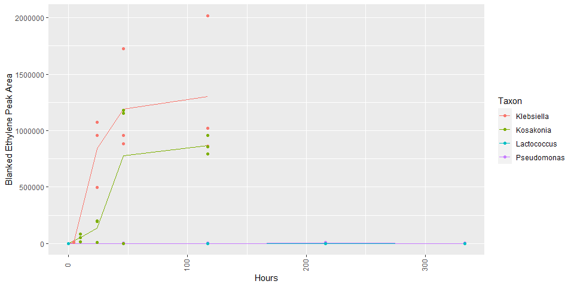
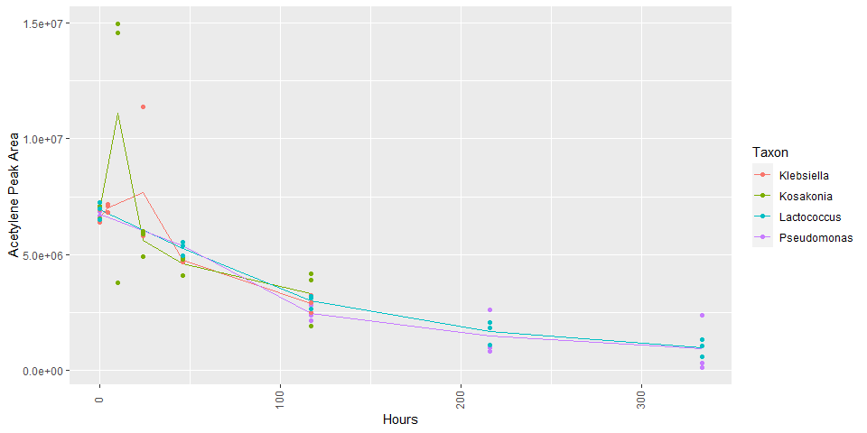
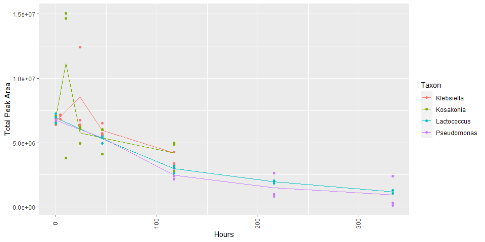
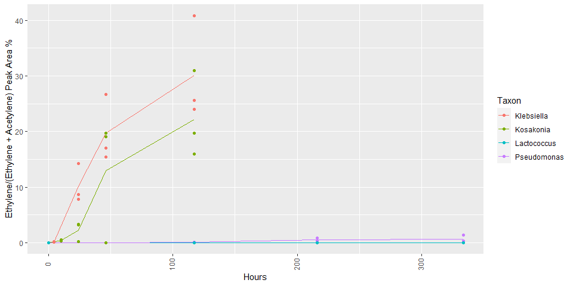

# 2023 HI ARA Time Series

### Import packages and set working directory.

##### R

```r
knitr::opts_knit$set(root.dir = rprojroot::find_rstudio_root_file())
library(reticulate)
library(ggplot2)
library(RColorBrewer)
library(dplyr)
```

##### Python

```python
import pandas as pd
import numpy as np
import os
```

### 2023 ARAs

```python
# in the future, convert to ethylene ppm based on standard curve
top=pd.DataFrame()
toptop=pd.DataFrame()
topblank=pd.DataFrame()
path = "20231017_time-series-data/"
for i in os.listdir(path):
  if i.endswith(".csv"):
    name = i.split("_",1)[1].replace("_rep1_MS.csv","").replace("_rep2_MS.csv","").replace("_rep3_MS.csv","").replace("_MS.csv","")
    data = pd.read_csv(path+i, header=3)
    data = data.iloc[:,1:24]
    # Note that these criteria are based on manual inspection of values, subject to change.
    data = data[data["RT"].between(2.62,2.70)]
    data.insert(loc=0,column="ID",value=i)
    top = pd.concat([top,data], axis=0)
    # Split each timepoint into own dataframe.
    t0 = top[top["ID"].str.contains("T0")].reset_index(drop=True)
    t1 = top[top["ID"].str.contains("T1")].reset_index(drop=True)
    t2 = top[top["ID"].str.contains("T2")].reset_index(drop=True)
    t3 = top[top["ID"].str.contains("T3")].reset_index(drop=True)
    t4 = top[top["ID"].str.contains("T4")].reset_index(drop=True)
    # Get blanks. Note we're just using T0 pos blank.
    blankt0 = t0[t0["ID"].str.contains("pos")]["Area"].mean()
    # Blank each timepoint.
    t0 = t0[~t0["ID"].str.contains("pos")]
    t0["Area-blanked"] = t0["Area"]-blankt0
    t1 = t1[~t1["ID"].str.contains("pos")]
    t1["Area-blanked"] = t1["Area"]-blankt0
    t2 = t2[~t2["ID"].str.contains("pos")]
    t2["Area-blanked"] = t2["Area"]-blankt0
    t3 = t3[~t3["ID"].str.contains("pos")]
    t3["Area-blanked"] = t3["Area"]-blankt0
    t4 = t4[~t4["ID"].str.contains("pos")]
    t4["Area-blanked"] = t4["Area"]-blankt0
    toptop=pd.concat([t0,t1,t2,t3,t4],axis=0)
toptop.reset_index(drop=True,inplace=True)
topblank=top[top["ID"].str.contains("blank_pos")]
final = toptop[~toptop["ID"].str.contains("neg")]
final.reset_index(drop=True,inplace=True)
final["Taxon"]=""
final["Dos Santos Group"]=""
final["Timepoint"]=""
final["Hours"]=0
for i,v in enumerate(final["ID"]):
  if "BCW200068" in v:
    final.at[i,"Taxon"]="Pseudomonas"
    final.at[i,"Dos Santos Group"]="SDS"
  if "BCW200167" in v:
    final.at[i,"Taxon"]="Klebsiella"
    final.at[i,"Dos Santos Group"]="DSP"
  if "BCW200181" in v:
    final.at[i,"Taxon"]="Kosakonia"
    final.at[i,"Dos Santos Group"]="DSP"
  if "BCW200241" in v:
    final.at[i,"Taxon"]="Lactococcus"
    final.at[i,"Dos Santos Group"]="DSN"
  if "T0" in v:
    final.at[i,"Timepoint"]="T0"
  if "T1" in v:
    final.at[i,"Timepoint"]="T1"
  if "T2" in v:
    final.at[i,"Timepoint"]="T2"
  if "T3" in v:
    final.at[i,"Timepoint"]="T3"
  if "T4" in v:
    final.at[i,"Timepoint"]="T4"
#final.to_csv("output/20231017_time-series.csv",index=False)
```

### Acetylene

```python
# in the future, convert to ethylene ppm based on standard curve
ace=pd.DataFrame()
path = "20231017_time-series-data/"
for i in os.listdir(path):
  if i.endswith(".csv"):
    name = i.split("_",1)[1].replace("_rep1_MS.csv","").replace("_rep2_MS.csv","").replace("_rep3_MS.csv","").replace("_MS.csv","")
    data = pd.read_csv(path+i, header=3)
    data = data.iloc[:,1:24]
    # Note that these criteria are based on manual inspection of values, subject to change.
    data = data[data["RT"].between(4.86,5.2)]
    data.insert(loc=0,column="ID",value=i)
    ace = pd.concat([ace,data], axis=0)
ace.reset_index(drop=True,inplace=True)
finalace = ace[~ace["ID"].str.contains("blank")]
blankace=ace[ace["ID"].str.contains("blank_pos")]
finalace.reset_index(drop=True,inplace=True)
finalace["Taxon"]=""
```

```
## <string>:1: SettingWithCopyWarning: 
## A value is trying to be set on a copy of a slice from a DataFrame.
## Try using .loc[row_indexer,col_indexer] = value instead
## 
## See the caveats in the documentation: https://pandas.pydata.org/pandas-docs/stable/user_guide/indexing.html#returning-a-view-versus-a-copy
```

```python
finalace["Dos Santos Group"]=""
```

```
## <string>:1: SettingWithCopyWarning: 
## A value is trying to be set on a copy of a slice from a DataFrame.
## Try using .loc[row_indexer,col_indexer] = value instead
## 
## See the caveats in the documentation: https://pandas.pydata.org/pandas-docs/stable/user_guide/indexing.html#returning-a-view-versus-a-copy
```

```python
finalace["Timepoint"]=""
```

```
## <string>:1: SettingWithCopyWarning: 
## A value is trying to be set on a copy of a slice from a DataFrame.
## Try using .loc[row_indexer,col_indexer] = value instead
## 
## See the caveats in the documentation: https://pandas.pydata.org/pandas-docs/stable/user_guide/indexing.html#returning-a-view-versus-a-copy
```

```python
finalace["Hours"]=0
```

```
## <string>:1: SettingWithCopyWarning: 
## A value is trying to be set on a copy of a slice from a DataFrame.
## Try using .loc[row_indexer,col_indexer] = value instead
## 
## See the caveats in the documentation: https://pandas.pydata.org/pandas-docs/stable/user_guide/indexing.html#returning-a-view-versus-a-copy
```

```python
for i,v in enumerate(finalace["ID"]):
  if "BCW200068" in v:
    finalace.at[i,"Taxon"]="Pseudomonas"
    finalace.at[i,"Dos Santos Group"]="SDS"
  if "BCW200167" in v:
    finalace.at[i,"Taxon"]="Klebsiella"
    finalace.at[i,"Dos Santos Group"]="DSP"
  if "BCW200181" in v:
    finalace.at[i,"Taxon"]="Kosakonia"
    finalace.at[i,"Dos Santos Group"]="DSP"
  if "BCW200241" in v:
    finalace.at[i,"Taxon"]="Lactococcus"
    finalace.at[i,"Dos Santos Group"]="DSN"
  if "T0" in v:
    finalace.at[i,"Timepoint"]="T0"
  if "T1" in v:
    finalace.at[i,"Timepoint"]="T1"
  if "T2" in v:
    finalace.at[i,"Timepoint"]="T2"
  if "T3" in v:
    finalace.at[i,"Timepoint"]="T3"
  if "T4" in v:
    finalace.at[i,"Timepoint"]="T4"
#finalace.to_csv("output/20231017_time-series-ace.csv",index=False)
```

### Plot

```r
data = read.csv("output/20231017_time-series-time-added.csv")
ace = read.csv("output/20231017_time-series-ace-time-added.csv")
# Ethylene
ggplot(data=data, aes(x=Hours, y=`Area.blanked`,color=Taxon)) +
  geom_line(stat="summary",fun="mean") + 
  geom_point() +
  ylab("Blanked Ethylene Peak Area") +
  theme(axis.text.x = element_text(angle=90, vjust=0.3))
```

<!-- -->

```r
# Acetylene
ggplot(data=ace, aes(x=Hours, y=Area,color=Taxon)) +
  geom_line(stat="summary",fun="mean") + 
  geom_point() +
  ylab("Acetylene Peak Area") +
  theme(axis.text.x = element_text(angle=90, vjust=0.3))
```

<!-- -->

```r
# Just Lacto and Pseudomonas
ggplot(data=data%>%filter(Taxon=="Pseudomonas" | Taxon=="Lactococcus"), aes(x=Hours, y=`Area.blanked`,color=Taxon)) +
  geom_line(stat="summary",fun="mean") + 
  geom_point() +
  ylab("Blanked Ethylene Peak Area") +
  theme(axis.text.x = element_text(angle=90, vjust=0.3))
```

<!-- -->

```r
# Just Lacto and Pseudomonas
#ggplot(data=data%>%filter(Taxon=="Pseudomonas" | Taxon=="Lactococcus"), aes(x=Hours, y=`Area`,color=Taxon)) +
#  geom_line(stat="summary",fun="mean") + 
#  geom_point() +
#  ylab("Raw Ethylene Peak Area") +
#  theme(axis.text.x = element_text(angle=90, vjust=0.3))
```

### Ethylene + Acetylene

```python
final=pd.read_csv("output/20231017_time-series-time-added.csv")
finalace=pd.read_csv("output/20231017_time-series-ace-time-added.csv")
final.set_index("ID",drop=True,inplace=True)
finalace.set_index("ID",drop=True,inplace=True)
test = final.join(finalace,rsuffix="_ace")
test["eth+ace_peak_area"] = test["Area"]+test["Area_ace"]
# The percentage of ethylene out of ethylene+acetylene.
test["eth_percent"] = (test["Area"]/test["eth+ace_peak_area"])*100
# Same for blanks
#topblank.set_index("ID",drop=True,inplace=True)
#blankace.set_index("ID",drop=True,inplace=True)
#testblank = topblank.join(blankace,rsuffix="_ace")
#testblank["eth+ace_peak_area"] = testblank["Area"]+testblank["Area_ace"]
#testblank["eth_percent"] = (testblank["Area"]/testblank["eth+ace_peak_area"])*100
#testblank["id"]="blank"
#testblank["Hours"]=[0,20,30,42.5,52.5,75]
```

### Plot Ethylene + Acetylene

```r
data = py$test
#blank = py$testblank
# Total Peak Area
ggplot(data=data, aes(x=Hours, y=`eth+ace_peak_area`,color=Taxon)) +
  geom_line(stat="summary",fun="mean") + 
  geom_point() +
  ylab("Total Peak Area") +
  theme(axis.text.x = element_text(angle=90, vjust=0.3))
```

<!-- -->

```r
# Total Peak Area Blanks
#ggplot(data=blank, aes(x=Hours, y=`eth+ace_peak_area`,color=id)) +
#  geom_line(stat="summary") + 
#  geom_point() +
#  ylab("Total Peak Area") +
#  theme(axis.text.x = element_text(angle=90, vjust=0.3))
# Acetylene Peak Area Blanks
#ggplot(data=blank, aes(x=Hours, y=`Area_ace`,color=id)) +
#  geom_line(stat="summary") + 
#  geom_point() +
#  ylab("Acetylene Peak Area") +
#  theme(axis.text.x = element_text(angle=90, vjust=0.3))
# Ethylene Peak Area Blanks
#ggplot(data=blank, aes(x=Hours, y=`Area`,color=id)) +
#  geom_line(stat="summary") + 
#  geom_point() +
#  ylab("Raw Ethylene Peak Area") +
#  theme(axis.text.x = element_text(angle=90, vjust=0.3))
# Ethylene Percent
ggplot(data=data, aes(x=Hours, y=eth_percent,color=Taxon)) +
  geom_line(stat="summary",fun="mean") + 
  geom_point() +
  ylab("Ethylene/(Ethylene + Acetylene) Peak Area %") +
  theme(axis.text.x = element_text(angle=90, vjust=0.3))
```

<!-- -->

```r
# Ethylene Percent Blanks
#ggplot(data=blank, aes(x=Hours, y=eth_percent,color=id)) +
#  geom_line(stat="summary") + 
#  geom_point() +
#  ylab("Ethylene/(Ethylene + Acetylene) Peak Area %") +
#  theme(axis.text.x = element_text(angle=90, vjust=0.3))
# Ethylene Percent Lacto and Pseudo
ggplot(data=data%>%filter(Taxon=="Pseudomonas" | Taxon=="Lactococcus"), aes(x=Hours, y=eth_percent,color=Taxon)) +
  geom_line(stat="summary",fun="mean") + 
  geom_point() +
  ylab("Ethylene/(Ethylene + Acetylene) Peak Area %") +
  theme(axis.text.x = element_text(angle=90, vjust=0.3))
```

<!-- -->
