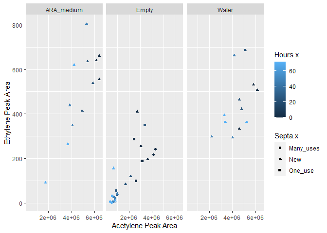
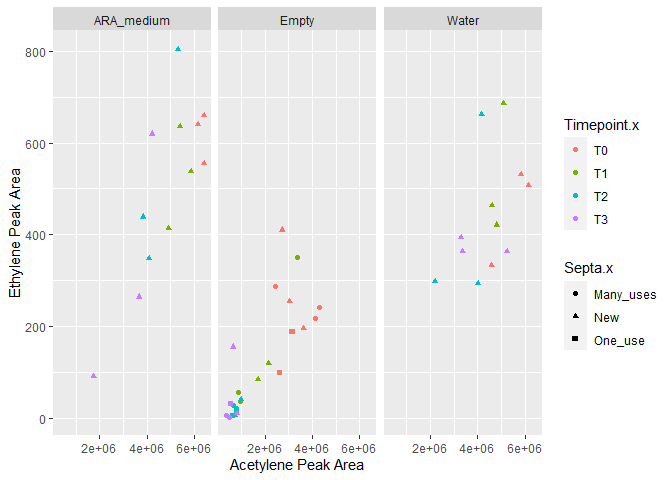
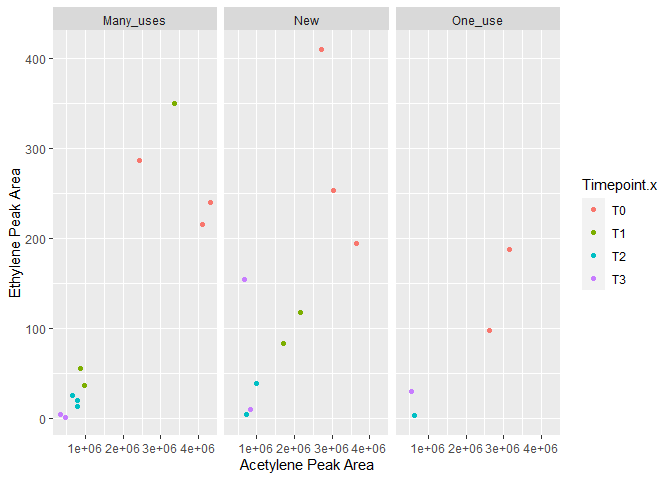

# 2023 HI ARA Time Series

### Import packages and set working directory.

##### R

```r
knitr::opts_knit$set(root.dir = rprojroot::find_rstudio_root_file())
library(reticulate)
library(ggplot2)
library(RColorBrewer)
library(dplyr)
```

##### Python

```python
import pandas as pd
import numpy as np
import os
```

### 2023 ARAs (2023-10-27_lacto)

```python
# in the future, convert to ethylene ppm based on standard curve
top=pd.DataFrame()
toptop=pd.DataFrame()
topblank=pd.DataFrame()
path = "20231027_lactococcus/"
for i in os.listdir(path):
  if i.endswith(".csv"):
    name = i.split("_",1)[1].replace("_rep1_MS.csv","").replace("_rep2_MS.csv","").replace("_rep3_MS.csv","").replace("_MS.csv","")
    data = pd.read_csv(path+i, header=3)
    data = data.iloc[:,1:24]
    # Note that these criteria are based on manual inspection of values, subject to change.
    data = data[data["RT"].between(2.60,2.70)]
    data.insert(loc=0,column="ID",value=i)
    top = pd.concat([top,data], axis=0)
    # Split each timepoint into own dataframe.
    t1 = top[top["ID"].str.contains("T1")].reset_index(drop=True)
    t2 = top[top["ID"].str.contains("T2")].reset_index(drop=True)
    # We're not blanking because pos data did not have peak.
    # Get blanks.
    #blankt1 = t1[t1["ID"].str.contains("pos")]["Area"].mean()
    #blankt2 = t2[t2["ID"].str.contains("pos")]["Area"].mean()
    # Blank each timepoint.
    #t1 = t1[~t1["ID"].str.contains("pos")]
    #t1["Area-blanked"] = t1["Area"]-blankt1
    #t2 = t2[~t2["ID"].str.contains("pos")]
    #t2["Area-blanked"] = t2["Area"]-blankt2
    toptop=pd.concat([t1,t2],axis=0)
toptop.reset_index(drop=True,inplace=True)
#topblank=top[top["ID"].str.contains("blank_pos")]
final = toptop[~toptop["ID"].str.contains("neg")]
final = final[~final["ID"].str.contains("pos")]
final.reset_index(drop=True,inplace=True)
final["State"]=""
final["Timepoint"]=""
final["Hours"]=0
for i,v in enumerate(final["ID"]):
  if "_LR_" in v:
    final.at[i,"State"]="LR"
  if "_N_" in v:
    final.at[i,"State"]="Newest"
  if "_OR_" in v:
    final.at[i,"State"]="Original"
  if "T1" in v:
    final.at[i,"Timepoint"]="T1"
    final.at[i,"Hours"]=48
  if "T2" in v:
    final.at[i,"Timepoint"]="T2"
    final.at[i,"Hours"]=114
```

### Acetylene

```python
# in the future, convert to ethylene ppm based on standard curve
ace=pd.DataFrame()
path = "20231027_lactococcus/"
for i in os.listdir(path):
  if i.endswith(".csv"):
    name = i.split("_",1)[1].replace("_rep1_MS.csv","").replace("_rep2_MS.csv","").replace("_rep3_MS.csv","").replace("_MS.csv","")
    data = pd.read_csv(path+i, header=3)
    data = data.iloc[:,1:24]
    # Note that these criteria are based on manual inspection of values, subject to change.
    data = data[data["RT"].between(4.86,5.2)]
    data.insert(loc=0,column="ID",value=i)
    ace = pd.concat([ace,data], axis=0)
ace.reset_index(drop=True,inplace=True)
finalace = ace[~ace["ID"].str.contains("blank")]
blankace=ace[ace["ID"].str.contains("blank_pos")]
finalace.reset_index(drop=True,inplace=True)
finalace["State"]=""
```

```
## <string>:1: SettingWithCopyWarning: 
## A value is trying to be set on a copy of a slice from a DataFrame.
## Try using .loc[row_indexer,col_indexer] = value instead
## 
## See the caveats in the documentation: https://pandas.pydata.org/pandas-docs/stable/user_guide/indexing.html#returning-a-view-versus-a-copy
```

```python
finalace["Timepoint"]=""
```

```
## <string>:1: SettingWithCopyWarning: 
## A value is trying to be set on a copy of a slice from a DataFrame.
## Try using .loc[row_indexer,col_indexer] = value instead
## 
## See the caveats in the documentation: https://pandas.pydata.org/pandas-docs/stable/user_guide/indexing.html#returning-a-view-versus-a-copy
```

```python
finalace["Hours"]=0
```

```
## <string>:1: SettingWithCopyWarning: 
## A value is trying to be set on a copy of a slice from a DataFrame.
## Try using .loc[row_indexer,col_indexer] = value instead
## 
## See the caveats in the documentation: https://pandas.pydata.org/pandas-docs/stable/user_guide/indexing.html#returning-a-view-versus-a-copy
```

```python
for i,v in enumerate(finalace["ID"]):
  if "_LR_" in v:
    finalace.at[i,"State"]="LR"
  if "_N_" in v:
    finalace.at[i,"State"]="Newest"
  if "_OR_" in v:
    finalace.at[i,"State"]="Original"
  if "T1" in v:
    finalace.at[i,"Timepoint"]="T1"
    finalace.at[i,"Hours"]=48
  if "T2" in v:
    finalace.at[i,"Timepoint"]="T2"
    finalace.at[i,"Hours"]=114
```

### Plot

```r
eth=py$final
mean_eth=eth%>%group_by(State,Hours)%>%summarize(mean_eth_area=mean(Area))
```

```
## `summarise()` has grouped output by 'State'. You can override using the
## `.groups` argument.
```

```r
mean_eth$Hours=as.numeric(mean_eth$Hours)
ace=py$finalace
mean_ace=ace%>%group_by(State,Hours)%>%summarize(mean_ace_area=mean(Area))
```

```
## `summarise()` has grouped output by 'State'. You can override using the
## `.groups` argument.
```

```r
mean_ace$Hours=as.numeric(mean_ace$Hours)
both=merge(x=ace,y=eth,by="ID")

# Ethlyene over time.
ggplot(data=mean_eth, aes(x=Hours,y=mean_eth_area,color=State)) +
  geom_line() +
  geom_point()
```

<!-- -->

```r
# Acetylene over time.
ggplot(data=mean_ace, aes(x=Hours,y=mean_ace_area,color=State)) +
  geom_line() +
  geom_point()
```

<!-- -->

```r
# Acetylene vs. ethylene.
ggplot(data=both, aes(x=Area.x,y=Area.y,color=State.x)) +
  geom_point()+
  ylab("Ethylene Peak Area") +
  xlab("Acetylene Peak Area")
```

<!-- -->

### Validating that the column still works like it used to.

```python
toptop=pd.DataFrame()
for i in os.listdir("std-curves/"):
  if os.path.isdir("std-curves/"+i):
    path = "std-curves/"+i
    top = pd.DataFrame()
    for j in os.listdir(path):
      if j.endswith(".csv") and "ppm" in j and "_0ppm_" not in j:
        name = j.split("_",1)[1].replace("_rep1_MS.csv","").replace("_rep2_MS.csv","").replace("_rep3_MS.csv","").replace("-rep1_MS.csv","").replace("-rep2_MS.csv","").replace("-rep3_MS.csv","").replace("_MS.csv","")
        data = pd.read_csv(path+"/"+j, header=1)
        data = data.iloc[:,1:24]
        # Note that these criteria are based on manual inspection of values, subject to change.
        data = data[data["RT"].between(2.59,2.70)]
        data = data[data["Area"]==data["Area"].max()]
        data.insert(loc=0,column="ID",value=name)
        top = pd.concat([top,data], axis=0)
        top.reset_index(drop=True,inplace=True)
    top.insert(loc=24,column="date",value=i)
    toptop=pd.concat([toptop,top],axis=0)
toptop.reset_index(drop=True,inplace=True)
toptop["eth-ppm"]=toptop["ID"].str.replace("ppm","")
toptop["eth-ppm"]=pd.to_numeric(toptop["eth-ppm"])

topace=pd.DataFrame()
for i in os.listdir("std-curves/"):
  if os.path.isdir("std-curves/"+i):
    path = "std-curves/"+i
    top = pd.DataFrame()
    for j in os.listdir(path):
      if j.endswith(".csv") and "ppm" in j and "_0ppm_" not in j:
        name = j.split("_",1)[1].replace("_rep1_MS.csv","").replace("_rep2_MS.csv","").replace("_rep3_MS.csv","").replace("-rep1_MS.csv","").replace("-rep2_MS.csv","").replace("-rep3_MS.csv","").replace("_MS.csv","")
        data = pd.read_csv(path+"/"+j, header=1)
        data = data.iloc[:,1:24]
        # Note that these criteria are based on manual inspection of values, subject to change.
        data = data[data["RT"].between(4.8,5.4)]
        data = data[data["Area"]==data["Area"].max()]
        data.insert(loc=0,column="ID",value=name)
        top = pd.concat([top,data], axis=0)
        top.reset_index(drop=True,inplace=True)
    top.insert(loc=24,column="date",value=i)
    topace=pd.concat([topace,top],axis=0)
topace.reset_index(drop=True,inplace=True)
topace["eth-ppm"]=topace["ID"].str.replace("ppm","")
topace["eth-ppm"]=pd.to_numeric(topace["eth-ppm"])
```


```r
eth=py$toptop
ace=py$topace
ggplot(data=eth%>%group_by(`eth-ppm`,date)%>%summarize(mean_eth_peak_area=mean(Area)),
       aes(x=`eth-ppm`,y=mean_eth_peak_area,color=date)) +
         geom_point() +
  scale_y_continuous(trans = "log10") +
  scale_x_continuous(trans = "log10") +
  ylab("log10(Mean Ethylene Peak Area)")+
  xlab("log10(Ethylene ppm)")
```

```
## `summarise()` has grouped output by 'eth-ppm'. You can override using the
## `.groups` argument.
```

<!-- -->

```r
ggplot(data=ace%>%group_by(`eth-ppm`,date)%>%summarize(mean_ace_peak_area=mean(Area)),
       aes(x=`eth-ppm`,y=mean_ace_peak_area,color=date)) +
         geom_point() +
  scale_y_continuous(trans = "log10",limits=c(5E6,5E7)) +
  scale_x_continuous(trans = "log10") +
  ylab("log10(Mean Acetylene Peak Area)")+
  xlab("log10(Ethylene ppm)")
```

```
## `summarise()` has grouped output by 'eth-ppm'. You can override using the
## `.groups` argument.
```

<!-- -->

### 2023 ARAs (2023-11-13_lacto)

```python
# in the future, convert to ethylene ppm based on standard curve
top=pd.DataFrame()
toptop=pd.DataFrame()
topblank=pd.DataFrame()
path = "20231113_lactococcus/"
for i in os.listdir(path):
  if i.endswith(".csv"):
    name = i.split("_",1)[1].replace("_rep1_MS.csv","").replace("_rep2_MS.csv","").replace("_rep3_MS.csv","").replace("_MS.csv","")
    data = pd.read_csv(path+i, header=3)
    data = data.iloc[:,1:24]
    # Note that these criteria are based on manual inspection of values, subject to change.
    data = data[data["RT"].between(2.60,2.70)]
    data=data[data["Area"]==data["Area"].max()]
    data.insert(loc=0,column="ID",value=i)
    top = pd.concat([top,data], axis=0)
    # Split each timepoint into own dataframe.
    t0 = top[top["ID"].str.contains("T0")].reset_index(drop=True)
    t1 = top[top["ID"].str.contains("T1")].reset_index(drop=True)
    t2 = top[top["ID"].str.contains("T2")].reset_index(drop=True)
    t3 = top[top["ID"].str.contains("T3")].reset_index(drop=True)
    t4 = top[top["ID"].str.contains("T4")].reset_index(drop=True)
    t5 = top[top["ID"].str.contains("T5")].reset_index(drop=True)
    # We're not blanking because pos data did not have peak.
    # Get blanks.
    blankt0 = t0[t0["ID"].str.contains("pos")]["Area"].mean()
    blankt1 = t1[t1["ID"].str.contains("pos")]["Area"].mean()
    blankt2 = t2[t2["ID"].str.contains("pos")]["Area"].mean()
    blankt3 = t3[t3["ID"].str.contains("pos")]["Area"].mean()
    blankt4 = t4[t4["ID"].str.contains("pos")]["Area"].mean()
    blankt5 = t5[t5["ID"].str.contains("pos")]["Area"].mean()
    # Blank each timepoint.
    t0 = t0[~t0["ID"].str.contains("pos")]
    t0["Area-blanked"] = t0["Area"]-blankt0
    t1 = t1[~t1["ID"].str.contains("pos")]
    t1["Area-blanked"] = t1["Area"]-blankt1
    t2 = t2[~t2["ID"].str.contains("pos")]
    t2["Area-blanked"] = t2["Area"]-blankt2
    t3 = t3[~t3["ID"].str.contains("pos")]
    t3["Area-blanked"] = t3["Area"]-blankt3
    t4 = t4[~t4["ID"].str.contains("pos")]
    t4["Area-blanked"] = t4["Area"]-blankt4
    t5 = t5[~t5["ID"].str.contains("pos")]
    t5["Area-blanked"] = t5["Area"]-blankt5
    toptop=pd.concat([t0,t1,t2,t3,t4,t5],axis=0)
toptop.reset_index(drop=True,inplace=True)
#topblank=top[top["ID"].str.contains("blank_pos")]
final = toptop[~toptop["ID"].str.contains("neg")]
final = final[~final["ID"].str.contains("pos")]
final.reset_index(drop=True,inplace=True)
final["Isolate"]=""
final["Timepoint"]=""
final["Hours"]=0
for i,v in enumerate(final["ID"]):
  if "BCW200158" in v:
    final.at[i,"Isolate"]="BCW200158"
  if "BCW200174" in v:
    final.at[i,"Isolate"]="BCW200174"
  if "BCW200232" in v:
    final.at[i,"Isolate"]="BCW200232"
  if "BCW200241" in v:
    final.at[i,"Isolate"]="BCW200241"
  if "T0" in v:
    final.at[i,"Timepoint"]="T0"
    final.at[i,"Hours"]=0
  if "T1" in v:
    final.at[i,"Timepoint"]="T1"
    final.at[i,"Hours"]=24
  if "T2" in v:
    final.at[i,"Timepoint"]="T2"
    final.at[i,"Hours"]=48
  if "T3" in v:
    final.at[i,"Timepoint"]="T3"
    final.at[i,"Hours"]=114.5
  if "T4" in v:
    final.at[i,"Timepoint"]="T4"
    final.at[i,"Hours"]=145
  if "T5" in v:
    final.at[i,"Timepoint"]="T5"
    final.at[i,"Hours"]=187
```

### Acetylene

```python
# in the future, convert to ethylene ppm based on standard curve
ace=pd.DataFrame()
path = "20231113_lactococcus/"
for i in os.listdir(path):
  if i.endswith(".csv"):
    name = i.split("_",1)[1].replace("_rep1_MS.csv","").replace("_rep2_MS.csv","").replace("_rep3_MS.csv","").replace("_MS.csv","")
    data = pd.read_csv(path+i, header=3)
    data = data.iloc[:,1:24]
    # Note that these criteria are based on manual inspection of values, subject to change.
    data = data[data["RT"].between(4.80,5.2)]
    data=data[data["Area"]==data["Area"].max()]
    data.insert(loc=0,column="ID",value=i)
    ace = pd.concat([ace,data], axis=0)
ace.reset_index(drop=True,inplace=True)
finalace = ace[~ace["ID"].str.contains("blank")]
blankace=ace[ace["ID"].str.contains("blank_pos")]
finalace.reset_index(drop=True,inplace=True)
finalace["Isolate"]=""
```

```
## <string>:1: SettingWithCopyWarning: 
## A value is trying to be set on a copy of a slice from a DataFrame.
## Try using .loc[row_indexer,col_indexer] = value instead
## 
## See the caveats in the documentation: https://pandas.pydata.org/pandas-docs/stable/user_guide/indexing.html#returning-a-view-versus-a-copy
```

```python
finalace["Timepoint"]=""
```

```
## <string>:1: SettingWithCopyWarning: 
## A value is trying to be set on a copy of a slice from a DataFrame.
## Try using .loc[row_indexer,col_indexer] = value instead
## 
## See the caveats in the documentation: https://pandas.pydata.org/pandas-docs/stable/user_guide/indexing.html#returning-a-view-versus-a-copy
```

```python
finalace["Hours"]=0
```

```
## <string>:1: SettingWithCopyWarning: 
## A value is trying to be set on a copy of a slice from a DataFrame.
## Try using .loc[row_indexer,col_indexer] = value instead
## 
## See the caveats in the documentation: https://pandas.pydata.org/pandas-docs/stable/user_guide/indexing.html#returning-a-view-versus-a-copy
```

```python
for i,v in enumerate(finalace["ID"]):
  if "BCW200158" in v:
    finalace.at[i,"Isolate"]="BCW200158"
  if "BCW200174" in v:
    finalace.at[i,"Isolate"]="BCW200174"
  if "BCW200232" in v:
    finalace.at[i,"Isolate"]="BCW200232"
  if "BCW200241" in v:
    finalace.at[i,"Isolate"]="BCW200241"
  if "T0" in v:
    finalace.at[i,"Timepoint"]="T0"
    finalace.at[i,"Hours"]=0
  if "T1" in v:
    finalace.at[i,"Timepoint"]="T1"
    finalace.at[i,"Hours"]=24
  if "T2" in v:
    finalace.at[i,"Timepoint"]="T2"
    finalace.at[i,"Hours"]=48
  if "T3" in v:
    finalace.at[i,"Timepoint"]="T3"
    finalace.at[i,"Hours"]=114.5
  if "T4" in v:
    finalace.at[i,"Timepoint"]="T4"
    finalace.at[i,"Hours"]=145
  if "T5" in v:
    finalace.at[i,"Timepoint"]="T5"
    finalace.at[i,"Hours"]=187
```

```
## <string>:21: SettingWithCopyWarning: 
## A value is trying to be set on a copy of a slice from a DataFrame.
## Try using .loc[row_indexer,col_indexer] = value instead
## 
## See the caveats in the documentation: https://pandas.pydata.org/pandas-docs/stable/user_guide/indexing.html#returning-a-view-versus-a-copy
```

```python
blankace.reset_index(drop=True,inplace=True)
for i,v in enumerate(blankace["ID"]):
  if "T0" in v:
    blankace.at[i,"Timepoint"]="T0"
    blankace.at[i,"Hours"]=0
  if "T1" in v:
    blankace.at[i,"Timepoint"]="T1"
    blankace.at[i,"Hours"]=24
  if "T2" in v:
    blankace.at[i,"Timepoint"]="T2"
    blankace.at[i,"Hours"]=48
  if "T3" in v:
    blankace.at[i,"Timepoint"]="T3"
    blankace.at[i,"Hours"]=114.5
  if "T4" in v:
    blankace.at[i,"Timepoint"]="T4"
    blankace.at[i,"Hours"]=145
  if "T5" in v:
    blankace.at[i,"Timepoint"]="T5"
    blankace.at[i,"Hours"]=187
```

```
## <string>:3: SettingWithCopyWarning: 
## A value is trying to be set on a copy of a slice from a DataFrame.
## Try using .loc[row_indexer,col_indexer] = value instead
## 
## See the caveats in the documentation: https://pandas.pydata.org/pandas-docs/stable/user_guide/indexing.html#returning-a-view-versus-a-copy
## <string>:4: SettingWithCopyWarning: 
## A value is trying to be set on a copy of a slice from a DataFrame.
## Try using .loc[row_indexer,col_indexer] = value instead
## 
## See the caveats in the documentation: https://pandas.pydata.org/pandas-docs/stable/user_guide/indexing.html#returning-a-view-versus-a-copy
```

### Plot

```r
eth=py$final
mean_eth=eth%>%group_by(Isolate,Hours)%>%summarize(mean_eth_area=mean(Area))
```

```
## `summarise()` has grouped output by 'Isolate'. You can override using the
## `.groups` argument.
```

```r
mean_eth$Hours=as.numeric(mean_eth$Hours)
ace=py$finalace
mean_ace=ace%>%group_by(Isolate,Hours)%>%summarize(mean_ace_area=mean(Area))
```

```
## `summarise()` has grouped output by 'Isolate'. You can override using the
## `.groups` argument.
```

```r
mean_ace$Hours=as.numeric(mean_ace$Hours)
both=merge(x=ace,y=eth,by="ID")
blankace=py$blankace

# Ethlyene over time.
ggplot(data=mean_eth, aes(x=Hours,y=mean_eth_area,color=Isolate)) +
  geom_line() +
  geom_point()
```

<!-- -->

```r
# Acetylene over time.
ggplot(data=mean_ace, aes(x=Hours,y=mean_ace_area,color=Isolate)) +
  geom_line() +
  geom_point()
```

<!-- -->

```r
# Acetylene vs. ethylene.
ggplot(data=both, aes(x=Area.x,y=Area.y,color=Hours.x)) +
  geom_point()+
  ylab("Ethylene Peak Area") +
  xlab("Acetylene Peak Area")
```

<!-- -->

```r
ggplot(data=both, aes(x=Area.x,y=Area.y,color=Timepoint.x)) +
  geom_point()+
  ylab("Ethylene Peak Area") +
  xlab("Acetylene Peak Area")
```

<!-- -->

```r
# Acetylene over time.
ggplot(data=blankace, aes(x=Hours,y=Area)) +
  geom_line() +
  geom_point() +
  ylab("Ethylene Peak Area")
```

<!-- -->

### 2023 ARAs (2023-11-14_septa-test)

```python
# in the future, convert to ethylene ppm based on standard curve
top=pd.DataFrame()
toptop=pd.DataFrame()
topblank=pd.DataFrame()
path = "20231117_septum-test/"
for i in os.listdir(path):
  if i.endswith(".csv"):
    name = i.split("_",1)[1].replace("_rep1_MS.csv","").replace("_rep2_MS.csv","").replace("_rep3_MS.csv","").replace("_MS.csv","")
    data = pd.read_csv(path+i, header=3)
    data = data.iloc[:,1:24]
    # Note that these criteria are based on manual inspection of values, subject to change.
    data = data[data["RT"].between(2.60,2.70)]
    data=data[data["Area"]==data["Area"].max()]
    data.insert(loc=0,column="ID",value=i)
    top = pd.concat([top,data], axis=0)
    # Split each timepoint into own dataframe.
    t0 = top[top["ID"].str.contains("T0")].reset_index(drop=True)
    t1 = top[top["ID"].str.contains("T1")].reset_index(drop=True)
    t2 = top[top["ID"].str.contains("T2")].reset_index(drop=True)
    t3 = top[top["ID"].str.contains("T3")].reset_index(drop=True)
    t4 = top[top["ID"].str.contains("T4")].reset_index(drop=True)
    # We're not blanking because pos data did not have peak.
    # Get blanks.
    #blankt0 = t0[t0["ID"].str.contains("pos")]["Area"].mean()
    #blankt1 = t1[t1["ID"].str.contains("pos")]["Area"].mean()
    #blankt2 = t2[t2["ID"].str.contains("pos")]["Area"].mean()
    #blankt3 = t3[t3["ID"].str.contains("pos")]["Area"].mean()
    #blankt4 = t4[t4["ID"].str.contains("pos")]["Area"].mean()
    # Blank each timepoint.
    #t0 = t0[~t0["ID"].str.contains("pos")]
    #t0["Area-blanked"] = t0["Area"]-blankt0
    #t1 = t1[~t1["ID"].str.contains("pos")]
    #t1["Area-blanked"] = t1["Area"]-blankt1
    #t2 = t2[~t2["ID"].str.contains("pos")]
    #t2["Area-blanked"] = t2["Area"]-blankt2
    #t3 = t3[~t3["ID"].str.contains("pos")]
    #t3["Area-blanked"] = t3["Area"]-blankt3
    #t4 = t4[~t4["ID"].str.contains("pos")]
    #t4["Area-blanked"] = t4["Area"]-blankt4
    #t5 = t5[~t5["ID"].str.contains("pos")]
    #t5["Area-blanked"] = t5["Area"]-blankt5
    toptop=pd.concat([t0,t1,t2,t3,t4],axis=0)
toptop.reset_index(drop=True,inplace=True)
#topblank=top[top["ID"].str.contains("blank_pos")]
final = toptop[~toptop["ID"].str.contains("blank")]
final = final[~final["ID"].str.contains("pos")]
final.reset_index(drop=True,inplace=True)
final["Septa"]=""
final["Medium"]=""
final["Timepoint"]=""
final["Hours"]=0
for i,v in enumerate(final["ID"]):
  if "_N_" in v:
    final.at[i,"Septa"]="New"
  if "4_M_" in v or "5_M_" in v or "6_M_" in v or "7_M_" in v:
    final.at[i,"Septa"]="Many_uses"
  if "_O_" in v:
    final.at[i,"Septa"]="One_use"
  if "_E_" in v:
    final.at[i,"Medium"]="Empty"
  if "_W_" in v:
    final.at[i,"Medium"]="Water"
  if "_M_T" in v:
    final.at[i,"Medium"]="ARA_medium"
  if "T0" in v:
    final.at[i,"Timepoint"]="T0"
    final.at[i,"Hours"]=0
  if "T1" in v:
    final.at[i,"Timepoint"]="T1"
    final.at[i,"Hours"]=24
  if "T2" in v:
    final.at[i,"Timepoint"]="T2"
    final.at[i,"Hours"]=48
  if "T3" in v:
    final.at[i,"Timepoint"]="T3"
    final.at[i,"Hours"]=72
  if "T4" in v:
    final.at[i,"Timepoint"]="T4"
    final.at[i,"Hours"]=145
  if "T5" in v:
    final.at[i,"Timepoint"]="T5"
    final.at[i,"Hours"]=187
```

### Acetylene

```python
# in the future, convert to ethylene ppm based on standard curve
ace=pd.DataFrame()
path = "20231117_septum-test//"
for i in os.listdir(path):
  if i.endswith(".csv"):
    name = i.split("_",1)[1].replace("_rep1_MS.csv","").replace("_rep2_MS.csv","").replace("_rep3_MS.csv","").replace("_MS.csv","")
    data = pd.read_csv(path+i, header=3)
    data = data.iloc[:,1:24]
    # Note that these criteria are based on manual inspection of values, subject to change.
    data = data[data["RT"].between(4.80,5.2)]
    data=data[data["Area"]==data["Area"].max()]
    data.insert(loc=0,column="ID",value=i)
    ace = pd.concat([ace,data], axis=0)
ace.reset_index(drop=True,inplace=True)
finalace = ace[~ace["ID"].str.contains("blank")]
#blankace=ace[ace["ID"].str.contains("blank_pos")]
finalace.reset_index(drop=True,inplace=True)
finalace["Septa"]=""
```

```
## <string>:1: SettingWithCopyWarning: 
## A value is trying to be set on a copy of a slice from a DataFrame.
## Try using .loc[row_indexer,col_indexer] = value instead
## 
## See the caveats in the documentation: https://pandas.pydata.org/pandas-docs/stable/user_guide/indexing.html#returning-a-view-versus-a-copy
```

```python
finalace["Medium"]=""
```

```
## <string>:1: SettingWithCopyWarning: 
## A value is trying to be set on a copy of a slice from a DataFrame.
## Try using .loc[row_indexer,col_indexer] = value instead
## 
## See the caveats in the documentation: https://pandas.pydata.org/pandas-docs/stable/user_guide/indexing.html#returning-a-view-versus-a-copy
```

```python
finalace["Timepoint"]=""
```

```
## <string>:1: SettingWithCopyWarning: 
## A value is trying to be set on a copy of a slice from a DataFrame.
## Try using .loc[row_indexer,col_indexer] = value instead
## 
## See the caveats in the documentation: https://pandas.pydata.org/pandas-docs/stable/user_guide/indexing.html#returning-a-view-versus-a-copy
```

```python
finalace["Hours"]=0
```

```
## <string>:1: SettingWithCopyWarning: 
## A value is trying to be set on a copy of a slice from a DataFrame.
## Try using .loc[row_indexer,col_indexer] = value instead
## 
## See the caveats in the documentation: https://pandas.pydata.org/pandas-docs/stable/user_guide/indexing.html#returning-a-view-versus-a-copy
```

```python
for i,v in enumerate(finalace["ID"]):
  if "_N_" in v:
    finalace.at[i,"Septa"]="New"
  if "4_M_" in v or "5_M_" in v or "6_M_" in v or "7_M_" in v:
    finalace.at[i,"Septa"]="Many_uses"
  if "_O_" in v:
    finalace.at[i,"Septa"]="One_use"
  if "_E_" in v:
    finalace.at[i,"Medium"]="Empty"
  if "_W_" in v:
    finalace.at[i,"Medium"]="Water"
  if "_M_T" in v:
    finalace.at[i,"Medium"]="ARA_medium"
  if "T0" in v:
    finalace.at[i,"Timepoint"]="T0"
    finalace.at[i,"Hours"]=0
  if "T1" in v:
    finalace.at[i,"Timepoint"]="T1"
    finalace.at[i,"Hours"]=24
  if "T2" in v:
    finalace.at[i,"Timepoint"]="T2"
    finalace.at[i,"Hours"]=48
  if "T3" in v:
    finalace.at[i,"Timepoint"]="T3"
    finalace.at[i,"Hours"]=72
  if "T4" in v:
    finalace.at[i,"Timepoint"]="T4"
    finalace.at[i,"Hours"]=145
  if "T5" in v:
    finalace.at[i,"Timepoint"]="T5"
    finalace.at[i,"Hours"]=187
```

### Plot

```r
eth=py$final
mean_eth=eth%>%group_by(Septa,Medium,Hours)%>%summarize(mean_eth_area=mean(Area))
```

```
## `summarise()` has grouped output by 'Septa', 'Medium'. You can override using
## the `.groups` argument.
```

```r
mean_eth$Hours=as.numeric(mean_eth$Hours)
ace=py$finalace
mean_ace=ace%>%group_by(Septa,Medium,Hours)%>%summarize(mean_ace_area=mean(Area))
```

```
## `summarise()` has grouped output by 'Septa', 'Medium'. You can override using
## the `.groups` argument.
```

```r
mean_ace$Hours=as.numeric(mean_ace$Hours)
both=merge(x=ace,y=eth,by="ID")
#blankace=py$blankace

# Ethlyene over time.
ggplot(data=mean_eth, aes(x=Hours,y=mean_eth_area,color=Medium)) +
  geom_line() +
  geom_point(data=mean_eth, aes(shape=Septa))
```

<!-- -->

```r
# Acetylene over time, comparing septa.
ggplot(data=mean_ace%>%filter(Medium=="Empty"), aes(x=Hours,y=mean_ace_area,color=Septa)) +
  geom_line() +
  geom_point(data=mean_ace%>%filter(Medium=="Empty")) +
  scale_y_continuous(breaks=c(0,1E6,2E6,3E6,4E6,5E6,6E6,7E6),limits=c(0,7E6)) +
  ggtitle("Different Septa, Only Argon+Acetylene in Vial")
```

<!-- -->

```r
# Acetylene over time, comparing media.
ggplot(data=mean_ace%>%filter(Septa=="New"), aes(x=Hours,y=mean_ace_area,color=Medium)) +
  geom_line() +
  geom_point(data=mean_ace%>%filter(Septa=="New")) +
  scale_y_continuous(breaks=c(0,1E6,2E6,3E6,4E6,5E6,6E6,7E6),limits=c(0,7E6)) +
  ggtitle("New Septa Only")
```

<!-- -->

```r
# Acetylene vs. ethylene.
ggplot(data=both, aes(x=Area.x,y=Area.y,color=Hours.x,shape=Septa.x)) +
  geom_point()+
  ylab("Ethylene Peak Area") +
  xlab("Acetylene Peak Area") +
  facet_wrap(facets="Medium.x")
```

<!-- -->

```r
ggplot(data=both, aes(x=Area.x,y=Area.y,color=Timepoint.x,shape=Septa.x)) +
  geom_point()+
  ylab("Ethylene Peak Area") +
  xlab("Acetylene Peak Area")+
  facet_wrap(facets="Medium.x")
```

<!-- -->

```r
ggplot(data=both%>%filter(Medium.x=="Empty"), aes(x=Area.x,y=Area.y,color=Timepoint.x)) +
  geom_point()+
  ylab("Ethylene Peak Area") +
  xlab("Acetylene Peak Area")+
  facet_wrap(facets="Septa.x")
```

<!-- -->
