# 2023 HI 20231218 Experiments

### Import packages and set working directory.

##### R

```r
knitr::opts_knit$set(root.dir = rprojroot::find_rstudio_root_file())
library(reticulate)
library(ggplot2)
library(RColorBrewer)
library(dplyr)
```

##### Python

```python
import pandas as pd
import numpy as np
import os
from sklearn import linear_model
```

### EKL Density Experiments.

##### Extract Ethylene Peaks for samples. Convert to nmol ethylene/hr/OD.

```python
toptop=pd.DataFrame()
for i in os.listdir("other-data/20231218_ekl-density"):
  if os.path.isdir("other-data/20231218_ekl-density/"+i):
    path = "other-data/20231218_ekl-density/"+i
    top = pd.DataFrame()
    for j in os.listdir(path):
      name = j.split("_",1)[1].replace("_rep1_MS.csv","").replace("_rep2_MS.csv","").replace("_rep3_MS.csv","").replace("_rep4_MS.csv","").replace("_MS_1.csv","").replace("_rep5_MS.csv","").replace("_MS.csv","")
      # At later dates, I stopped running neg for samples so I didn't say they were "pos". Need to add that label.
      if "pos" not in name and "neg" not in name:
        name = name+"_pos"
      data = pd.read_csv(path+"/"+j, header=3)
      data = data.iloc[:,1:24]
      # Note that these criteria are based on manual inspection of values, subject to change.
      data = data[data["RT"].between(2.4,2.68)]
      # Some small peaks of non-ethylene mess with getting ethylene peak only.
      # If ethylene is present, it is the highest peak, so getting the highest peak within the RT range.
      data = data[data["Area"]==data["Area"].max()]
      data.insert(loc=0,column="ID",value=name)
      top = pd.concat([top,data], axis=0)
    # Blanking, and remove blanks from final dataframe.
    if "uninoc_pos" in top["ID"].to_list():
      blank = top[top["ID"]=="uninoc_pos"]["Area"].mean()
      top = top[top["ID"]!="uninoc_pos"]
      top["Area"] = top["Area"]-blank
      top.reset_index(drop=True,inplace=True)
      top.insert(loc=24,column="date",value=i)
      toptop = pd.concat([top,toptop], axis=0)
    else:
      blank = top[top["ID"]=="blank_pos"]["Area"].mean()
      top = top[top["ID"]!="blank_pos"]
      top["Area"] = top["Area"]-blank
      top.reset_index(drop=True,inplace=True)
      top.insert(loc=24,column="date",value=i)
      toptop = pd.concat([top,toptop], axis=0)
toptop.reset_index(drop=True,inplace=True)
# "Pos" samples have acetylene. "Neg" do not. Separate.
#pos = toptop[toptop["ID"].str.contains("pos")]
#neg = toptop[toptop["ID"].str.contains("neg")]

# Convert peak area to nmol ethylene.
toptopnmol=pd.DataFrame()
# Run for loop for dates in order so if no std curve for that date
# then use the most recent std curve before that date.
# For 20231213, using std curve values from 20231215.
toptop["date"]=pd.to_numeric(toptop["date"])
dates=[i for i in toptop["date"].unique()]
dates.sort()
for i in dates:
  subs=toptop[toptop["date"]==i]
  # This uses an old std curve calculation.
  if i<20231208:
    subs["nmol-eth"]=(subs["Area"]-17690)/383.46
    subs["nmol-eth/hr/OD"]=(subs["nmol-eth"]/48/0.1)
    toptopnmol=pd.concat([subs,toptopnmol],axis=0)
  # This uses the std curve run on the same day.
  elif subs["ID"].str.contains("ppm").any():
    subsppm=subs[subs["ID"].str.contains("ppm")]
    #subsppm=subsppm[~subsppm["ID"].str.contains("_N_")]
    if subsppm["ID"].str.contains("_N_").any():
      subsppm["concentration"]=pd.to_numeric(subsppm["ID"].str.replace("ppm_N_pos",""))
    else:
      subsppm["concentration"]=pd.to_numeric(subsppm["ID"].str.replace("ppm_pos",""))
    # At STP, there are 669245.5nmol gas in 15mL of headspace. This is what we're assuming.
    # To convert ppm to nmol of gas, simply take the proportion of the nmol total.
    subsppm["nmol"]= 669245.5*(subsppm["concentration"]/1E6)
    x=subsppm["nmol"].values
    y=subsppm["Area"].values
    x=x.reshape(len(x),1)
    y=y.reshape(len(x),1)
    regr=linear_model.LinearRegression().fit(x,y)
    coef=regr.coef_[0]
    intercept=regr.intercept_[0]
    subs["nmol-eth"]=(subs["Area"]-intercept)/coef
    subs["nmol-eth/hr/OD"]=(subs["nmol-eth"]/48/0.1)
    toptopnmol=pd.concat([subs,toptopnmol],axis=0)
  else:
    # Since this is run sequentially by date, just use the last values if don't have ppm.
    subs["nmol-eth"]=(subs["Area"]-intercept)/coef
    subs["nmol-eth/hr/OD"]=(subs["nmol-eth"]/48/0.1)
    toptopnmol=pd.concat([subs,toptopnmol],axis=0)
```

```
## <string>:15: SettingWithCopyWarning: 
## A value is trying to be set on a copy of a slice from a DataFrame.
## Try using .loc[row_indexer,col_indexer] = value instead
## 
## See the caveats in the documentation: https://pandas.pydata.org/pandas-docs/stable/user_guide/indexing.html#returning-a-view-versus-a-copy
## <string>:18: SettingWithCopyWarning: 
## A value is trying to be set on a copy of a slice from a DataFrame.
## Try using .loc[row_indexer,col_indexer] = value instead
## 
## See the caveats in the documentation: https://pandas.pydata.org/pandas-docs/stable/user_guide/indexing.html#returning-a-view-versus-a-copy
## <string>:26: SettingWithCopyWarning: 
## A value is trying to be set on a copy of a slice from a DataFrame.
## Try using .loc[row_indexer,col_indexer] = value instead
## 
## See the caveats in the documentation: https://pandas.pydata.org/pandas-docs/stable/user_guide/indexing.html#returning-a-view-versus-a-copy
## <string>:27: SettingWithCopyWarning: 
## A value is trying to be set on a copy of a slice from a DataFrame.
## Try using .loc[row_indexer,col_indexer] = value instead
## 
## See the caveats in the documentation: https://pandas.pydata.org/pandas-docs/stable/user_guide/indexing.html#returning-a-view-versus-a-copy
## <string>:15: SettingWithCopyWarning: 
## A value is trying to be set on a copy of a slice from a DataFrame.
## Try using .loc[row_indexer,col_indexer] = value instead
## 
## See the caveats in the documentation: https://pandas.pydata.org/pandas-docs/stable/user_guide/indexing.html#returning-a-view-versus-a-copy
## <string>:18: SettingWithCopyWarning: 
## A value is trying to be set on a copy of a slice from a DataFrame.
## Try using .loc[row_indexer,col_indexer] = value instead
## 
## See the caveats in the documentation: https://pandas.pydata.org/pandas-docs/stable/user_guide/indexing.html#returning-a-view-versus-a-copy
## <string>:26: SettingWithCopyWarning: 
## A value is trying to be set on a copy of a slice from a DataFrame.
## Try using .loc[row_indexer,col_indexer] = value instead
## 
## See the caveats in the documentation: https://pandas.pydata.org/pandas-docs/stable/user_guide/indexing.html#returning-a-view-versus-a-copy
## <string>:27: SettingWithCopyWarning: 
## A value is trying to be set on a copy of a slice from a DataFrame.
## Try using .loc[row_indexer,col_indexer] = value instead
## 
## See the caveats in the documentation: https://pandas.pydata.org/pandas-docs/stable/user_guide/indexing.html#returning-a-view-versus-a-copy
```

```python
# Remove std curve samples.
toptopnmol=toptopnmol[~toptopnmol["ID"].str.contains("ppm")]
# Remove blank samples.
toptopnmol=toptopnmol[~toptopnmol["ID"].str.contains("blank")]
# Remove samples without acetylene.
toptopnmol=toptopnmol[~toptopnmol["ID"].str.contains("neg")]
toptopnmol["date"]=toptopnmol["date"].astype(str)
toptopnmol["new-ID"]=toptopnmol["ID"].str.replace("_pos","_")+toptopnmol["date"]

# Add metadata.
toptopnmol.reset_index(drop=True,inplace=True)
toptopnmol["Isolate"]=""
toptopnmol["Hours"]=0
toptopnmol["OD"]=0.1
for i,v in enumerate(toptopnmol["ID"]):
  if "BCW200241" in v:
    toptopnmol.loc[i,"Isolate"]="N-fixing Lactococcus"
  if "BCW200232" in v:
    toptopnmol.loc[i,"Isolate"]="non-fixing Lactococcus"
  if "BCW200167" in v:
    toptopnmol.loc[i,"Isolate"]="Klebsiella"
  if "Ecoli" in v:
    toptopnmol.loc[i,"Isolate"]="E. coli"
  if "T2" in v:
    toptopnmol.loc[i,"Hours"]=48
  if "HD" in v:
    toptopnmol.loc[i,"OD"]=1
    toptopnmol.loc[i,"Hours"]=48

# We're assuming 48hr incubation for all. There are slight variations (+-2hr). Can correct in the future.

# Removing Totontepec.
#meta=pd.read_csv("data/2022-06-30_molokai-isolate-catalog - Copy.csv")
#meta=meta.iloc[:-1,:]
#toton=meta[meta["Sample Type "].str.contains("Totontepec")]
#len(toton)
#toton["BCW_ID"]=toton["BCW_ID"].str.replace("BCW_","BCW")
#non = list(set([i for i in pos["ID"] if i.replace("_pos","") not in toton["BCW_ID"].to_list()]))
#nontoton=pos[pos["ID"].isin(non)]
#final_non=pd.DataFrame({"ID":nontoton["ID"].str.replace("_pos","").unique()})
#final_non.to_csv("../2023_wgs_dna/data/20231106_nontoton-ara-screened.csv",index=False)
#len(pos["ID"].unique())
```


##### Plot nmol ethylene/hr/od. Bar charts.

```r
data = py$toptopnmol

# Ethylene scatter. All 4 isolates.
ggplot(data=data%>%group_by(Isolate,Hours,OD), aes(x=`Hours`, y=`nmol-eth`,color=as.factor(OD))) +
  geom_point(size=3) +
  facet_wrap(~Isolate)
```

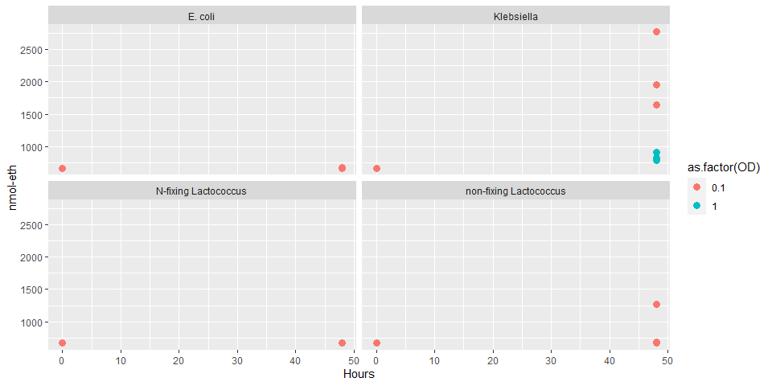<!-- -->

```r
# Ethylene scatter. Only BCW200241.
ggplot(data=data%>%group_by(Isolate,Hours,OD)%>%filter(Isolate=="N-fixing Lactococcus"), aes(x=`Hours`, y=`nmol-eth`,color=as.factor(OD))) +
  geom_point(size=3) +
  scale_y_continuous(limits=c(0,675))
```

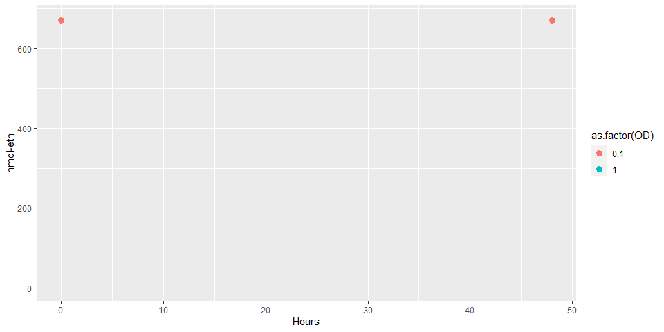<!-- -->

```r
# Ethylene scatter. Only BCW200241, zoomed in.
ggplot(data=data%>%group_by(Isolate,Hours,OD)%>%filter(Isolate=="N-fixing Lactococcus"), aes(x=`Hours`, y=`nmol-eth`,color=as.factor(OD))) +
  geom_point(size=3)
```

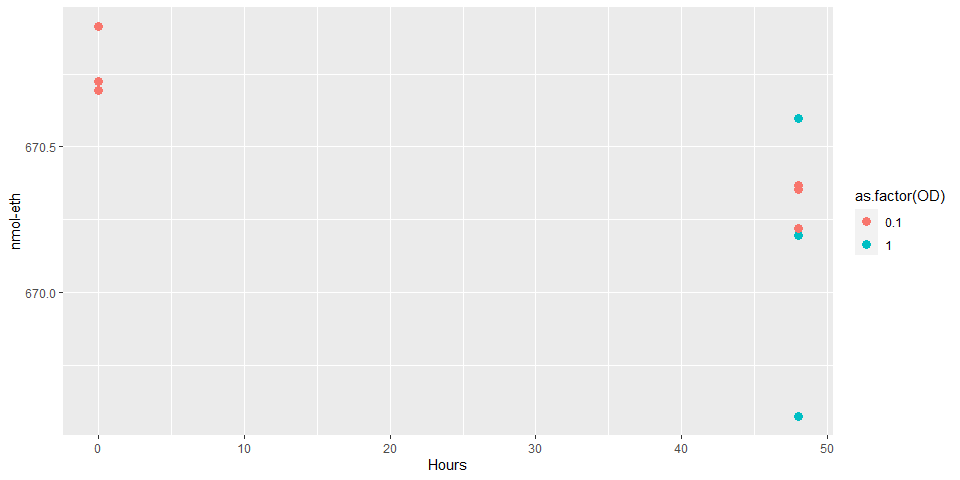<!-- -->

##### Extract Acetylene Peak Areas.

```python
toptop=pd.DataFrame()
for i in os.listdir("other-data/20231218_ekl-density"):
  if os.path.isdir("other-data/20231218_ekl-density/"+i):
    path = "other-data/20231218_ekl-density/"+i
    for j in os.listdir(path):
      name = j.split("_",1)[1].replace("_rep1_MS.csv","").replace("_rep2_MS.csv","").replace("_rep3_MS.csv","").replace("_rep4_MS.csv","").replace("_MS_1.csv","").replace("_rep5_MS.csv","").replace("_MS.csv","")
      # At later dates, I stopped running neg for samples so I didn't say they were "pos". Need to add that label.
      if "pos" not in name and "neg" not in name:
        name = name+"_pos"
      data = pd.read_csv(path+"/"+j, header=3)
      data = data.iloc[:,1:24]
      # Note that these criteria are based on manual inspection of values, subject to change.
      data = data[data["RT"].between(4.7,5.4)]
      # If acetylene is present, it is the highest peak, so getting the highest peak within the RT range.
      data = data[data["Area"]==data["Area"].max()]
      data.insert(loc=0,column="ID",value=name)
      data.insert(loc=24,column="date",value=i)
      toptop = pd.concat([toptop,data], axis=0)
toptop.reset_index(drop=True,inplace=True)
finalace = toptop[~toptop["ID"].str.contains("blank")]
finalace = finalace[~finalace["ID"].str.contains("uninoc")]
finalace = finalace[~finalace["ID"].str.contains("neg")]
finalace = finalace[~finalace["ID"].str.contains("ppm")]
finalace["new-ID"]=finalace["ID"].str.replace("_pos","_")+finalace["date"]
finalace.reset_index(drop=True,inplace=True)
finalace["Isolate"]=""
finalace["Hours"]=0
finalace["OD"]=0.1
for i,v in enumerate(finalace["ID"]):
  if "BCW200241" in v:
    finalace.loc[i,"Isolate"]="N-fixing Lactococcus"
  if "BCW200232" in v:
    finalace.loc[i,"Isolate"]="non-fixing Lactococcus"
  if "BCW200167" in v:
    finalace.loc[i,"Isolate"]="Klebsiella"
  if "Ecoli" in v:
    finalace.loc[i,"Isolate"]="E. coli"
  if "T2" in v:
    finalace.loc[i,"Hours"]=48
  if "HD" in v:
    finalace.loc[i,"OD"]=1
    finalace.loc[i,"Hours"]=48
```

##### Plot acetylene values. Barcharts and mean acetylene vs. mean ethylene.

```r
ace=py$finalace
data=py$toptopnmol

# Acetylene peak area.
ggplot(data=ace, aes(x=ID, y=Area)) +
  geom_bar(stat="summary",fun="mean", aes(fill=as.factor(Isolate))) + 
  geom_point() +
  ylab("Acetylene Peak Area") +
  theme(axis.text.x = element_text(angle=90))
```

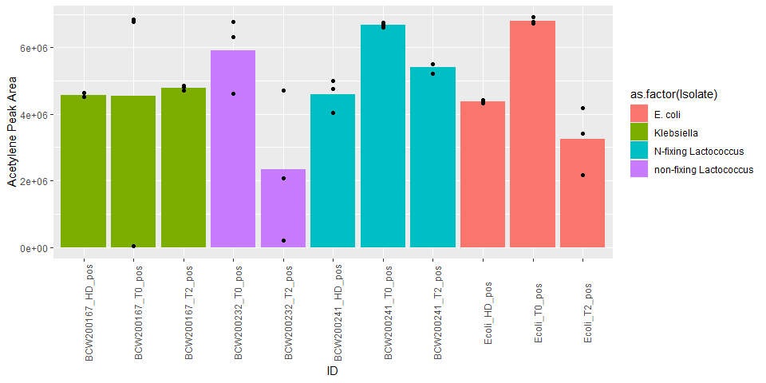<!-- -->

```r
# Combine mean acetylene and mean ethylene information.
mean_ace=ace%>%group_by(`new-ID`,date)%>%summarize(mean_ace_area=mean(Area))
```

```
## `summarise()` has grouped output by 'new-ID'. You can override using the
## `.groups` argument.
```

```r
mean_eth=data%>%group_by(`new-ID`,date)%>%summarize(mean_eth_area=mean(Area),mean_nmol_per_hr_OD=mean(`nmol-eth/hr/OD`))
```

```
## `summarise()` has grouped output by 'new-ID'. You can override using the
## `.groups` argument.
```

```r
test=merge(x=mean_eth,y=mean_ace,by=c("new-ID","date"))

# Mean acetylene vs. mean ethylene.
ggplot(data=test, aes(x=mean_ace_area,y=mean_eth_area,color=date)) +
  geom_point(size=4)
```

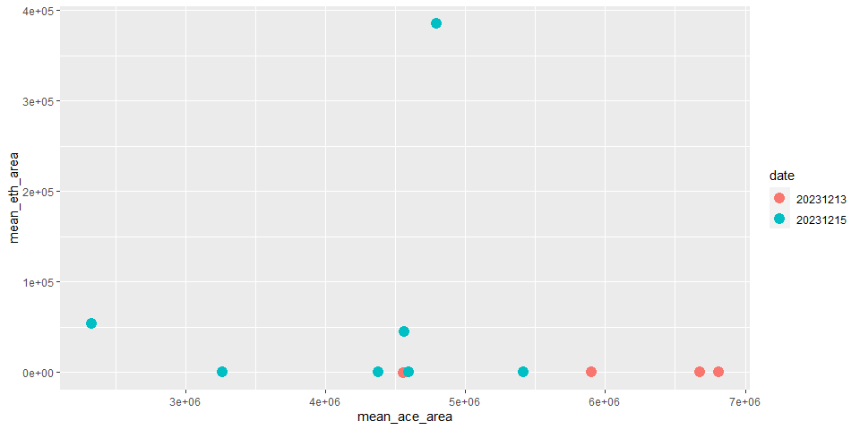<!-- -->

##### Get every vial's ethylene and acetylene peak areas.

```python
# Acetylene.
toptop=pd.DataFrame()
for i in os.listdir("other-data/20231218_ekl-density"):
  if os.path.isdir("other-data/20231218_ekl-density/"+i):
    path = "other-data/20231218_ekl-density/"+i
    for j in os.listdir(path):
      name = j
      # At later dates, I stopped running neg for samples so I didn't say they were "pos". Need to add that label.
      if "pos" not in name and "neg" not in name:
        name = name+"_pos"
      data = pd.read_csv(path+"/"+j, header=3)
      data = data.iloc[:,1:24]
      # Note that these criteria are based on manual inspection of values, subject to change.
      data = data[data["RT"].between(4.7,5.4)]
      # Some small peaks of non-ethylene mess with getting ethylene peak only.
      # If ethylene is present, it is the highest peak, so getting the highest peak within the RT range.
      data = data[data["Area"]==data["Area"].max()]
      data.insert(loc=0,column="ID",value=name)
      data.insert(loc=24,column="date",value=i)
      toptop = pd.concat([toptop,data], axis=0)
toptop.reset_index(drop=True,inplace=True)
finalace = toptop[~toptop["ID"].str.contains("blank")]
finalace = finalace[~finalace["ID"].str.contains("uninoc")]
finalace = finalace[~finalace["ID"].str.contains("neg")]
finalace = finalace[~finalace["ID"].str.contains("ppm")]
finalace.set_index("ID",inplace=True)

# Ethylene.
top=pd.DataFrame()
for i in os.listdir("other-data/20231218_ekl-density"):
  if os.path.isdir("other-data/20231218_ekl-density/"+i):
    path = "other-data/20231218_ekl-density/"+i
    for j in os.listdir(path):
      name = j
      # At later dates, I stopped running neg for samples so I didn't say they were "pos". Need to add that label.
      if "pos" not in name and "neg" not in name:
        name = name+"_pos"
      data = pd.read_csv(path+"/"+j, header=3)
      data = data.iloc[:,1:24]
      # Note that these criteria are based on manual inspection of values, subject to change.
      data = data[data["RT"].between(2.4,2.68)]
      # Some small peaks of non-ethylene mess with getting ethylene peak only.
      # If ethylene is present, it is the highest peak, so getting the highest peak within the RT range.
      data = data[data["Area"]==data["Area"].max()]
      data.insert(loc=0,column="ID",value=name)
      data.insert(loc=24,column="date",value=i)
      top = pd.concat([top,data], axis=0)
top.reset_index(drop=True,inplace=True)
finaleth = top[~top["ID"].str.contains("blank")]
finaleth = finaleth[~finaleth["ID"].str.contains("uninoc")]
finaleth = finaleth[~finaleth["ID"].str.contains("neg")]
finaleth = finaleth[~finaleth["ID"].str.contains("ppm")]
finaleth.set_index("ID",inplace=True)

# Combine acetylene and ethylene.
both=finaleth.join(finalace,lsuffix="_eth",rsuffix="_ace")
both.reset_index(inplace=True)
both["Isolate"]=""
both["Hours"]=0
both["OD"]=0.1
for i,v in enumerate(both["ID"]):
  if "BCW200241" in v:
    both.loc[i,"Isolate"]="N-fixing Lactococcus"
  if "BCW200232" in v:
    both.loc[i,"Isolate"]="non-fixing Lactococcus"
  if "BCW200167" in v:
    both.loc[i,"Isolate"]="Klebsiella"
  if "Ecoli" in v:
    both.loc[i,"Isolate"]="E. coli"
  if "T2" in v:
    both.loc[i,"Hours"]=48
  if "HD" in v:
    both.loc[i,"OD"]=1
    both.loc[i,"Hours"]=48
```

##### Plot acetylene vs. ethylene. For every vial.

```r
data=py$both

#All data.
ggplot(data=data, aes(x=Area_ace,y=Area_eth,color=as.factor(OD))) +
  geom_point(size=4,aes(shape=as.factor(Hours))) +
  #scale_x_continuous(breaks=c(0,2.5E6,5E6,7.5E6,1E7,1.25E7,1.5E7,1.75E7),limits=c(0,1.75E7)) +
  #scale_y_continuous(breaks=c(0,1E6,2E6,3E6,4E6,5E6),limits=c(0,5E6)) +
  xlab("Acetylene Peak Area") +
  ylab("Ethylene Peak Area") +
  facet_wrap(~Isolate)
```

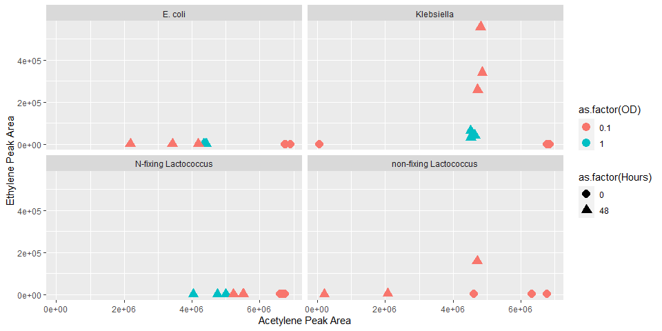<!-- -->

### Time Series

```python
toptop=pd.DataFrame()
for i in os.listdir("other-data/20231218_ekl-time-series"):
  if os.path.isdir("other-data/20231218_ekl-time-series/"+i):
    path = "other-data/20231218_ekl-time-series/"+i
    top = pd.DataFrame()
    for j in os.listdir(path):
      name = j.split("_",1)[1].replace("_rep1_MS.csv","").replace("_rep2_MS.csv","").replace("_rep3_MS.csv","").replace("_rep4_MS.csv","").replace("_MS_1.csv","").replace("_rep5_MS.csv","").replace("_MS.csv","")
      # At later dates, I stopped running neg for samples so I didn't say they were "pos". Need to add that label.
      if "pos" not in name and "neg" not in name:
        name = name+"_pos"
      data = pd.read_csv(path+"/"+j, header=3)
      data = data.iloc[:,1:24]
      # Note that these criteria are based on manual inspection of values, subject to change.
      data = data[data["RT"].between(2.4,2.68)]
      # Some small peaks of non-ethylene mess with getting ethylene peak only.
      # If ethylene is present, it is the highest peak, so getting the highest peak within the RT range.
      data = data[data["Area"]==data["Area"].max()]
      data.insert(loc=0,column="ID",value=name)
      top = pd.concat([top,data], axis=0)
    # Blanking, and remove blanks from final dataframe.
    if "uninoc_pos" in top["ID"].to_list():
      blank = top[top["ID"]=="uninoc_pos"]["Area"].mean()
      top = top[top["ID"]!="uninoc_pos"]
      top["Area"] = top["Area"]-blank
      top.reset_index(drop=True,inplace=True)
      top.insert(loc=24,column="date",value=i)
      toptop = pd.concat([top,toptop], axis=0)
    else:
      blank = top[top["ID"]=="blank_pos"]["Area"].mean()
      top = top[top["ID"]!="blank_pos"]
      top["Area"] = top["Area"]-blank
      top.reset_index(drop=True,inplace=True)
      top.insert(loc=24,column="date",value=i)
      toptop = pd.concat([top,toptop], axis=0)
toptop.reset_index(drop=True,inplace=True)
# "Pos" samples have acetylene. "Neg" do not. Separate.
#pos = toptop[toptop["ID"].str.contains("pos")]
#neg = toptop[toptop["ID"].str.contains("neg")]

# Convert peak area to nmol ethylene.
toptopnmol=pd.DataFrame()
# Run for loop for dates in order so if no std curve for that date
# then use the most recent std curve before that date.
# For 20231213, using std curve values from 20231215.
toptop["date"]=pd.to_numeric(toptop["date"])
dates=[i for i in toptop["date"].unique()]
dates.sort()
for i in dates:
  subs=toptop[toptop["date"]==i]
  # This uses an old std curve calculation.
  if i<20231208:
    subs["nmol-eth"]=(subs["Area"]-17690)/383.46
    subs["nmol-eth/hr/OD"]=(subs["nmol-eth"]/48/0.1)
    toptopnmol=pd.concat([subs,toptopnmol],axis=0)
  # This uses the std curve run on the same day.
  elif subs["ID"].str.contains("ppm").any():
    subsppm=subs[subs["ID"].str.contains("ppm")]
    #subsppm=subsppm[~subsppm["ID"].str.contains("_N_")]
    if subsppm["ID"].str.contains("_N_").any():
      subsppm["concentration"]=pd.to_numeric(subsppm["ID"].str.replace("ppm_N_pos",""))
    else:
      subsppm["concentration"]=pd.to_numeric(subsppm["ID"].str.replace("ppm_pos",""))
    # At STP, there are 669245.5nmol gas in 15mL of headspace. This is what we're assuming.
    # To convert ppm to nmol of gas, simply take the proportion of the nmol total.
    subsppm["nmol"]= 669245.5*(subsppm["concentration"]/1E6)
    x=subsppm["nmol"].values
    y=subsppm["Area"].values
    x=x.reshape(len(x),1)
    y=y.reshape(len(x),1)
    regr=linear_model.LinearRegression().fit(x,y)
    coef=regr.coef_[0]
    intercept=regr.intercept_[0]
    subs["nmol-eth"]=(subs["Area"]-intercept)/coef
    if i==20231213:
      subs["nmol-eth/hr/OD"]=0
    elif i==20231214:
      subs["nmol-eth/hr/OD"]=(subs["nmol-eth"]/24/0.1)
    elif i==20231215:
      subs["nmol-eth/hr/OD"]=(subs["nmol-eth"]/48/0.1)
    elif i==20231216:
      subs["nmol-eth/hr/OD"]=(subs["nmol-eth"]/69/0.1)
    toptopnmol=pd.concat([subs,toptopnmol],axis=0)
```

```
## <string>:15: SettingWithCopyWarning: 
## A value is trying to be set on a copy of a slice from a DataFrame.
## Try using .loc[row_indexer,col_indexer] = value instead
## 
## See the caveats in the documentation: https://pandas.pydata.org/pandas-docs/stable/user_guide/indexing.html#returning-a-view-versus-a-copy
## <string>:18: SettingWithCopyWarning: 
## A value is trying to be set on a copy of a slice from a DataFrame.
## Try using .loc[row_indexer,col_indexer] = value instead
## 
## See the caveats in the documentation: https://pandas.pydata.org/pandas-docs/stable/user_guide/indexing.html#returning-a-view-versus-a-copy
## <string>:26: SettingWithCopyWarning: 
## A value is trying to be set on a copy of a slice from a DataFrame.
## Try using .loc[row_indexer,col_indexer] = value instead
## 
## See the caveats in the documentation: https://pandas.pydata.org/pandas-docs/stable/user_guide/indexing.html#returning-a-view-versus-a-copy
## <string>:28: SettingWithCopyWarning: 
## A value is trying to be set on a copy of a slice from a DataFrame.
## Try using .loc[row_indexer,col_indexer] = value instead
## 
## See the caveats in the documentation: https://pandas.pydata.org/pandas-docs/stable/user_guide/indexing.html#returning-a-view-versus-a-copy
## <string>:15: SettingWithCopyWarning: 
## A value is trying to be set on a copy of a slice from a DataFrame.
## Try using .loc[row_indexer,col_indexer] = value instead
## 
## See the caveats in the documentation: https://pandas.pydata.org/pandas-docs/stable/user_guide/indexing.html#returning-a-view-versus-a-copy
## <string>:18: SettingWithCopyWarning: 
## A value is trying to be set on a copy of a slice from a DataFrame.
## Try using .loc[row_indexer,col_indexer] = value instead
## 
## See the caveats in the documentation: https://pandas.pydata.org/pandas-docs/stable/user_guide/indexing.html#returning-a-view-versus-a-copy
## <string>:26: SettingWithCopyWarning: 
## A value is trying to be set on a copy of a slice from a DataFrame.
## Try using .loc[row_indexer,col_indexer] = value instead
## 
## See the caveats in the documentation: https://pandas.pydata.org/pandas-docs/stable/user_guide/indexing.html#returning-a-view-versus-a-copy
## <string>:30: SettingWithCopyWarning: 
## A value is trying to be set on a copy of a slice from a DataFrame.
## Try using .loc[row_indexer,col_indexer] = value instead
## 
## See the caveats in the documentation: https://pandas.pydata.org/pandas-docs/stable/user_guide/indexing.html#returning-a-view-versus-a-copy
## <string>:15: SettingWithCopyWarning: 
## A value is trying to be set on a copy of a slice from a DataFrame.
## Try using .loc[row_indexer,col_indexer] = value instead
## 
## See the caveats in the documentation: https://pandas.pydata.org/pandas-docs/stable/user_guide/indexing.html#returning-a-view-versus-a-copy
## <string>:18: SettingWithCopyWarning: 
## A value is trying to be set on a copy of a slice from a DataFrame.
## Try using .loc[row_indexer,col_indexer] = value instead
## 
## See the caveats in the documentation: https://pandas.pydata.org/pandas-docs/stable/user_guide/indexing.html#returning-a-view-versus-a-copy
## <string>:26: SettingWithCopyWarning: 
## A value is trying to be set on a copy of a slice from a DataFrame.
## Try using .loc[row_indexer,col_indexer] = value instead
## 
## See the caveats in the documentation: https://pandas.pydata.org/pandas-docs/stable/user_guide/indexing.html#returning-a-view-versus-a-copy
## <string>:32: SettingWithCopyWarning: 
## A value is trying to be set on a copy of a slice from a DataFrame.
## Try using .loc[row_indexer,col_indexer] = value instead
## 
## See the caveats in the documentation: https://pandas.pydata.org/pandas-docs/stable/user_guide/indexing.html#returning-a-view-versus-a-copy
## <string>:15: SettingWithCopyWarning: 
## A value is trying to be set on a copy of a slice from a DataFrame.
## Try using .loc[row_indexer,col_indexer] = value instead
## 
## See the caveats in the documentation: https://pandas.pydata.org/pandas-docs/stable/user_guide/indexing.html#returning-a-view-versus-a-copy
## <string>:18: SettingWithCopyWarning: 
## A value is trying to be set on a copy of a slice from a DataFrame.
## Try using .loc[row_indexer,col_indexer] = value instead
## 
## See the caveats in the documentation: https://pandas.pydata.org/pandas-docs/stable/user_guide/indexing.html#returning-a-view-versus-a-copy
## <string>:26: SettingWithCopyWarning: 
## A value is trying to be set on a copy of a slice from a DataFrame.
## Try using .loc[row_indexer,col_indexer] = value instead
## 
## See the caveats in the documentation: https://pandas.pydata.org/pandas-docs/stable/user_guide/indexing.html#returning-a-view-versus-a-copy
## <string>:34: SettingWithCopyWarning: 
## A value is trying to be set on a copy of a slice from a DataFrame.
## Try using .loc[row_indexer,col_indexer] = value instead
## 
## See the caveats in the documentation: https://pandas.pydata.org/pandas-docs/stable/user_guide/indexing.html#returning-a-view-versus-a-copy
```

```python
# Remove std curve samples.
toptopnmol=toptopnmol[~toptopnmol["ID"].str.contains("ppm")]
# Remove blank samples.
toptopnmol=toptopnmol[~toptopnmol["ID"].str.contains("blank")]
# Remove samples without acetylene.
toptopnmol=toptopnmol[~toptopnmol["ID"].str.contains("neg")]
toptopnmol["date"]=toptopnmol["date"].astype(str)
toptopnmol["new-ID"]=toptopnmol["ID"].str.replace("_pos","_")+toptopnmol["date"]

# Add metadata.
toptopnmol.reset_index(drop=True,inplace=True)
toptopnmol["Isolate"]=""
toptopnmol["Hours"]=0
toptopnmol["OD"]=0.1
for i,v in enumerate(toptopnmol["new-ID"]):
  if "BCW200241" in v:
    toptopnmol.loc[i,"Isolate"]="N-fixing Lactococcus"
  if "BCW200232" in v:
    toptopnmol.loc[i,"Isolate"]="non-fixing Lactococcus"
  if "BCW200167" in v:
    toptopnmol.loc[i,"Isolate"]="Klebsiella"
  if "Ecoli" in v:
    toptopnmol.loc[i,"Isolate"]="E. coli"
  if "20231213" in v:
    toptopnmol.loc[i,"Hours"]=0
  if "20231214" in v:
    toptopnmol.loc[i,"Hours"]=24
  if "20231215" in v:
    toptopnmol.loc[i,"Hours"]=48
  if "20231216" in v:
    toptopnmol.loc[i,"Hours"]=69

# We're assuming 48hr incubation for all. There are slight variations (+-2hr). Can correct in the future.

# Removing Totontepec.
#meta=pd.read_csv("data/2022-06-30_molokai-isolate-catalog - Copy.csv")
#meta=meta.iloc[:-1,:]
#toton=meta[meta["Sample Type "].str.contains("Totontepec")]
#len(toton)
#toton["BCW_ID"]=toton["BCW_ID"].str.replace("BCW_","BCW")
#non = list(set([i for i in pos["ID"] if i.replace("_pos","") not in toton["BCW_ID"].to_list()]))
#nontoton=pos[pos["ID"].isin(non)]
#final_non=pd.DataFrame({"ID":nontoton["ID"].str.replace("_pos","").unique()})
#final_non.to_csv("../2023_wgs_dna/data/20231106_nontoton-ara-screened.csv",index=False)
#len(pos["ID"].unique())
```

##### Plot Time Series.

```r
data=py$toptopnmol

# All Isolates. Total nmol, facet-wrap.
ggplot(data,aes(x=Hours,y=`nmol-eth`,color=Isolate)) +
  geom_point(size=3) +
  facet_wrap(~Isolate) +
  geom_line(data=data%>%group_by(Isolate,Hours)%>%summarize(mean=mean(`nmol-eth`)),
            aes(x=Hours,y=mean))
```

```
## `summarise()` has grouped output by 'Isolate'. You can override using the
## `.groups` argument.
```

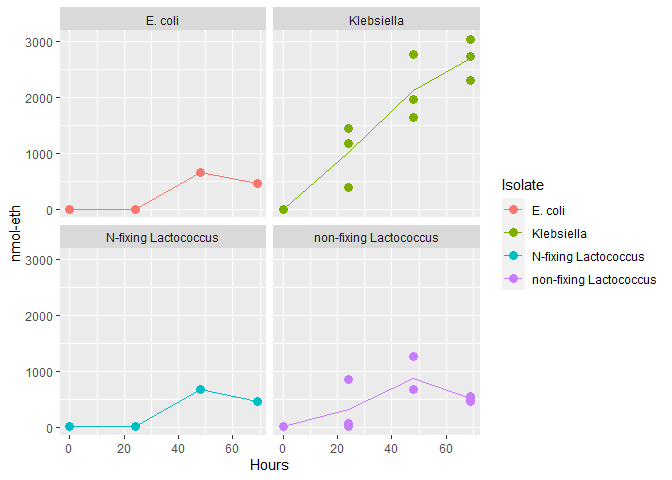<!-- -->

```r
# All Isolates. nmol/hr/OD.
ggplot(data,aes(x=Hours,y=`nmol-eth/hr/OD`,color=Isolate)) +
  geom_point(size=3) +
  facet_wrap(~Isolate) +
  geom_line(data=data%>%group_by(Isolate,Hours)%>%summarize(mean=mean(`nmol-eth/hr/OD`)),
            aes(x=Hours,y=mean))
```

```
## `summarise()` has grouped output by 'Isolate'. You can override using the
## `.groups` argument.
```

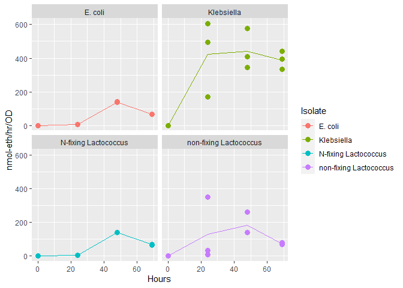<!-- -->

```r
# All Isolates. nmol/hr/OD.
ggplot(data,aes(x=Hours,y=`Area`,color=Isolate)) +
  geom_point(size=3) +
  facet_wrap(~Isolate) +
  geom_line(data=data%>%group_by(Isolate,Hours)%>%summarize(mean=mean(`Area`)),
            aes(x=Hours,y=mean))
```

```
## `summarise()` has grouped output by 'Isolate'. You can override using the
## `.groups` argument.
```

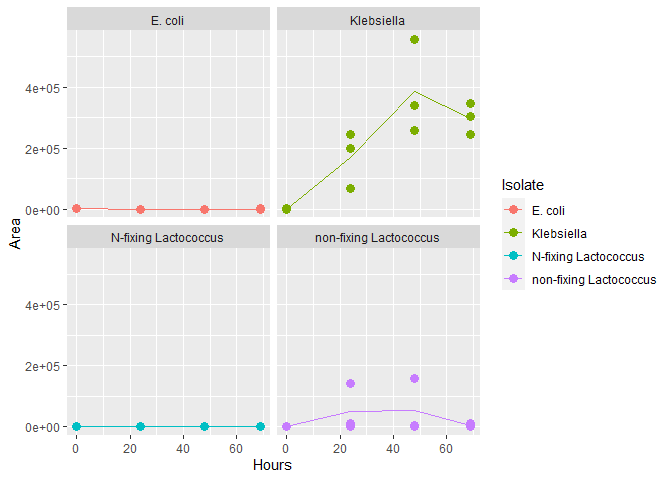<!-- -->
##### Time Series Acetylene

```python
toptop=pd.DataFrame()
for i in os.listdir("other-data/20231218_ekl-time-series"):
  if os.path.isdir("other-data/20231218_ekl-time-series/"+i):
    path = "other-data/20231218_ekl-time-series/"+i
    for j in os.listdir(path):
      name = j.split("_",1)[1].replace("_rep1_MS.csv","").replace("_rep2_MS.csv","").replace("_rep3_MS.csv","").replace("_rep4_MS.csv","").replace("_MS_1.csv","").replace("_rep5_MS.csv","").replace("_MS.csv","")
      # At later dates, I stopped running neg for samples so I didn't say they were "pos". Need to add that label.
      if "pos" not in name and "neg" not in name:
        name = name+"_pos"
      data = pd.read_csv(path+"/"+j, header=3)
      data = data.iloc[:,1:24]
      # Note that these criteria are based on manual inspection of values, subject to change.
      data = data[data["RT"].between(4.7,5.4)]
      # If acetylene is present, it is the highest peak, so getting the highest peak within the RT range.
      data = data[data["Area"]==data["Area"].max()]
      data.insert(loc=0,column="ID",value=name)
      data.insert(loc=24,column="date",value=i)
      toptop = pd.concat([toptop,data], axis=0)
toptop.reset_index(drop=True,inplace=True)
finalace = toptop[~toptop["ID"].str.contains("blank")]
finalace = finalace[~finalace["ID"].str.contains("uninoc")]
finalace = finalace[~finalace["ID"].str.contains("neg")]
finalace = finalace[~finalace["ID"].str.contains("ppm")]
finalace["new-ID"]=finalace["ID"].str.replace("_pos","_")+finalace["date"]
finalace.reset_index(drop=True,inplace=True)
finalace["Isolate"]=""
finalace["Hours"]=0
finalace["OD"]=0.1
for i,v in enumerate(finalace["new-ID"]):
  if "BCW200241" in v:
    finalace.loc[i,"Isolate"]="N-fixing Lactococcus"
  if "BCW200232" in v:
    finalace.loc[i,"Isolate"]="non-fixing Lactococcus"
  if "BCW200167" in v:
    finalace.loc[i,"Isolate"]="Klebsiella"
  if "Ecoli" in v:
    finalace.loc[i,"Isolate"]="E. coli"
  if "20231213" in v:
    finalace.loc[i,"Hours"]=0
  if "20231214" in v:
    finalace.loc[i,"Hours"]=24
  if "20231215" in v:
    finalace.loc[i,"Hours"]=48
  if "20231216" in v:
    finalace.loc[i,"Hours"]=69
```

##### Plot Time Series.

```r
data=py$finalace

# All Isolates. Total nmol, facet-wrap.
ggplot(data,aes(x=Hours,y=Area,color=Isolate)) +
  geom_point(size=3) +
  facet_wrap(~Isolate) +
  geom_line(data=data%>%group_by(Isolate,Hours)%>%summarize(mean=mean(Area)),
            aes(x=Hours,y=mean))
```

```
## `summarise()` has grouped output by 'Isolate'. You can override using the
## `.groups` argument.
```

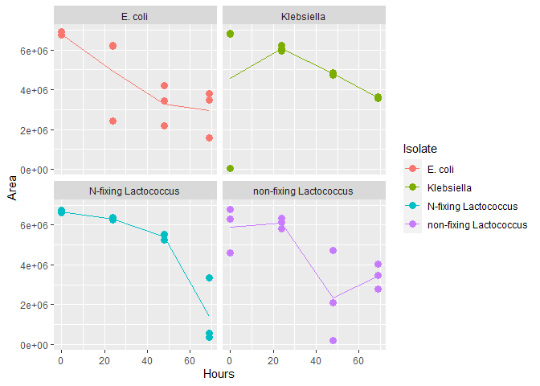<!-- -->


### 20231228 Septum Test

##### Extract Acetylene Peak Areas.

```python
toptop=pd.DataFrame()
path = "other-data/20231218_septum-test/"
for j in os.listdir(path):
  name = j.split("_",1)[1].replace("_rep1_MS.csv","").replace("_rep2_MS.csv","").replace("_rep3_MS.csv","").replace("_rep4_MS.csv","").replace("_MS_1.csv","").replace("_rep5_MS.csv","").replace("_MS.csv","")
  # At later dates, I stopped running neg for samples so I didn't say they were "pos". Need to add that label.
  if "pos" not in name and "neg" not in name:
    name = name+"_pos"
  data = pd.read_csv(path+"/"+j, header=3)
  data = data.iloc[:,1:24]
  # Note that these criteria are based on manual inspection of values, subject to change.
  data = data[data["RT"].between(4.7,5.4)]
  # If acetylene is present, it is the highest peak, so getting the highest peak within the RT range.
  data = data[data["Area"]==data["Area"].max()]
  data.insert(loc=0,column="ID",value=name)
  data.insert(loc=24,column="date",value=i)
  toptop = pd.concat([toptop,data], axis=0)
toptop.reset_index(drop=True,inplace=True)
finalace = toptop[~toptop["ID"].str.contains("blank")]
finalace = finalace[~finalace["ID"].str.contains("uninoc")]
finalace = finalace[~finalace["ID"].str.contains("neg")]
finalace = finalace[~finalace["ID"].str.contains("ppm")]
finalace["new-ID"]=finalace["ID"].str.replace("_pos","_")+str(finalace["date"])
finalace.reset_index(drop=True,inplace=True)

finalace["Septum"]=""
for i,v in enumerate(finalace["ID"]):
  if "BN" in v:
    finalace.loc[i,"Septum"]="Brand New"
  if "UO" in v:
    finalace.loc[i,"Septum"]="Used Once"
  if "UM" in v:
    finalace.loc[i,"Septum"]="Used Many"
```

##### Get every vial's ethylene and acetylene peak areas.

```r
data=py$finalace

# Acetylene peak area.
ggplot(data=data, aes(x=ID, y=Area)) +
  geom_bar(stat="summary",fun="mean", aes(fill=Septum)) + 
  geom_point() +
  ylab("Acetylene Peak Area") +
  theme(axis.text.x = element_text(angle=90))
```

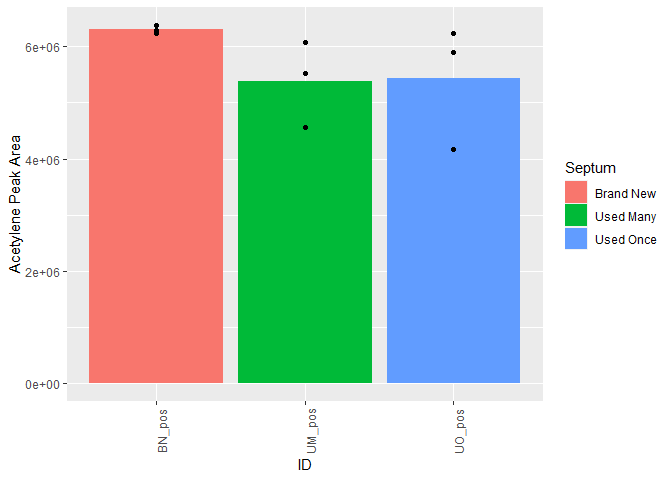<!-- -->

##### Plot acetylene vs. ethylene. For every vial.

```r
data=py$both

#All data.
ggplot(data=data, aes(x=Area_ace,y=Area_eth,color=as.factor(Hours))) +
  geom_point(size=4,aes(shape=as.factor(Hours))) +
  #scale_x_continuous(breaks=c(0,2.5E6,5E6,7.5E6,1E7,1.25E7,1.5E7,1.75E7),limits=c(0,1.75E7)) +
  #scale_y_continuous(breaks=c(0,1E6,2E6,3E6,4E6,5E6),limits=c(0,5E6)) +
  xlab("Acetylene Peak Area") +
  ylab("Ethylene Peak Area") +
  facet_wrap(~Isolate)
```

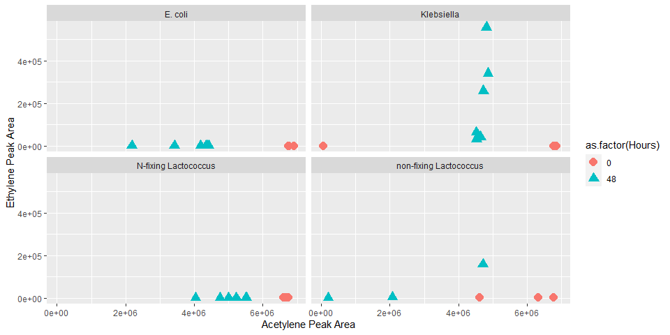<!-- -->


##### Ethylene standard curve visualization.

```python
toptop=pd.DataFrame()
for i in os.listdir("data/"):
  if os.path.isdir("data/"+i):
    path = "data/"+i
    top = pd.DataFrame()
    for j in os.listdir(path):
      name = j.split("_",1)[1].replace("_rep1_MS.csv","").replace("_rep2_MS.csv","").replace("_rep3_MS.csv","").replace("_rep4_MS.csv","").replace("_MS_1.csv","").replace("_rep5_MS.csv","").replace("_MS.csv","")
      # At later dates, I stopped running neg for samples so I didn't say they were "pos". Need to add that label.
      if "pos" not in name and "neg" not in name:
        name = name+"_pos"
      data = pd.read_csv(path+"/"+j, header=3)
      data = data.iloc[:,1:24]
      # Note that these criteria are based on manual inspection of values, subject to change.
      data = data[data["RT"].between(2.4,2.68)]
      # Some small peaks of non-ethylene mess with getting ethylene peak only.
      # If ethylene is present, it is the highest peak, so getting the highest peak within the RT range.
      data = data[data["Area"]==data["Area"].max()]
      data.insert(loc=0,column="ID",value=name)
      top = pd.concat([top,data], axis=0)
    # Blanking, and remove blanks from final dataframe.
    if "uninoc_pos" in top["ID"].to_list():
      blank = top[top["ID"]=="uninoc_pos"]["Area"].mean()
      top = top[top["ID"]!="uninoc_pos"]
      top["Area"] = top["Area"]-blank
      top.reset_index(drop=True,inplace=True)
      top.insert(loc=24,column="date",value=i)
      toptop = pd.concat([top,toptop], axis=0)
    else:
      blank = top[top["ID"]=="blank_pos"]["Area"].mean()
      top = top[top["ID"]!="blank_pos"]
      top["Area"] = top["Area"]-blank
      top.reset_index(drop=True,inplace=True)
      top.insert(loc=24,column="date",value=i)
      toptop = pd.concat([top,toptop], axis=0)
toptop.reset_index(drop=True,inplace=True)

ppmeth=toptop[toptop["ID"].str.contains("ppm")].reset_index(drop=True)
ppmeth["concentration"]=pd.to_numeric(ppmeth["ID"].str.replace("ppm_pos","").str.replace("ppm_N_pos",""))
# At STP, there are 669245.5nmol gas in 15mL of headspace. This is what we're assuming.
# To convert ppm to nmol of gas, simply take the proportion of the nmol total.
ppmeth["nmol"]= 669245.5*(ppmeth["concentration"]/1E6)
```


##### Plot std curves.

```r
ppmeth=py$ppmeth
for (i in unique(ppmeth$date)){
  data=ppmeth%>%filter(date==i)
  model=lm(Area ~ nmol, data=data)
  plt = ggplot(data=data, aes(x=nmol,y=Area)) +
    geom_point(size=4) +
    stat_smooth(method = "lm", col="red") +
    scale_x_continuous(trans=scales::pseudo_log_trans(base = 10),breaks=c(0,1,10,100,1000,1E4,1E5)) +
    scale_y_continuous(trans=scales::pseudo_log_trans(base = 10),breaks=c(0,10,100,1000,1E4,1E5,1E6,1E7,1E8)) +
    labs(title = paste(i,"R^2 = ",signif(summary(model)$r.squared, 5),
                     "Intercept =",signif(model$coef[[1]],5 ),
                     " Slope =",signif(model$coef[[2]], 5),
                     " P =",signif(summary(model)$coef[2,4], 5))) +
    xlab("Ethylene Concentration (nmol)") +
    ylab("Ethylene Peak Area")
  show(plt)
}

ggplot(data=ppmeth%>%group_by(date), aes(x=nmol,y=Area,color=date))+
  geom_point(size=4)+
  scale_x_continuous(trans=scales::pseudo_log_trans(base = 10),breaks=c(0,1,10,100,1000,1E4,1E5)) +
  scale_y_continuous(trans=scales::pseudo_log_trans(base = 10),breaks=c(0,10,100,1000,1E4,1E5,1E6,1E7,1E8)) +
  stat_smooth(method = "lm") +
  xlab("Ethylene Concentration (nmol)") +
  ylab("Ethylene Peak Area")
```
