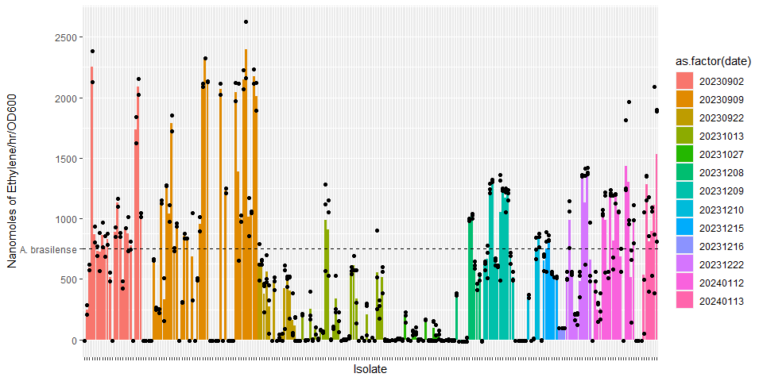
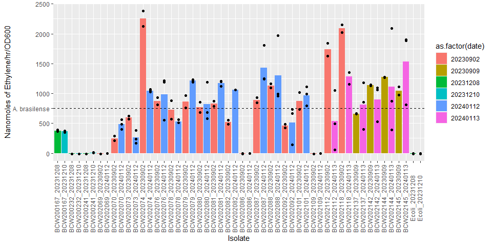
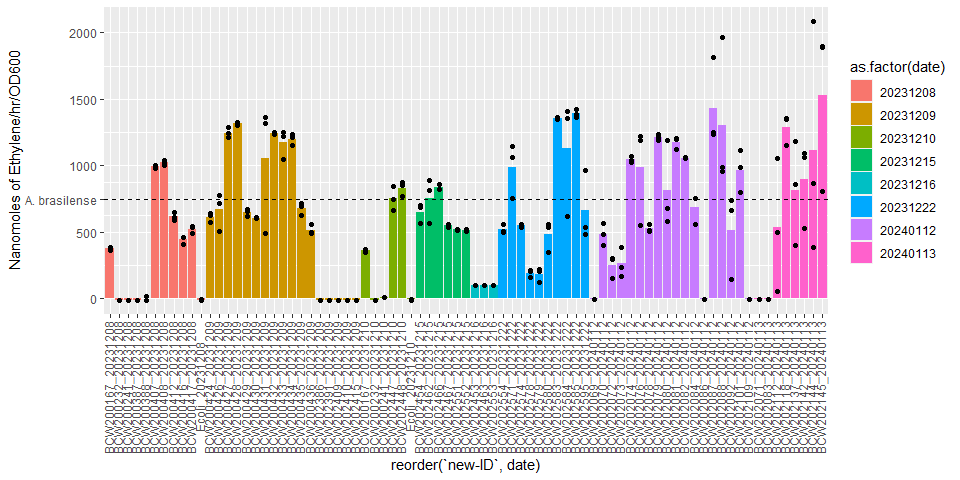
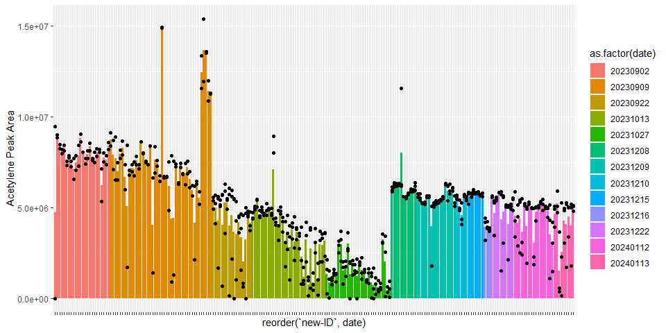
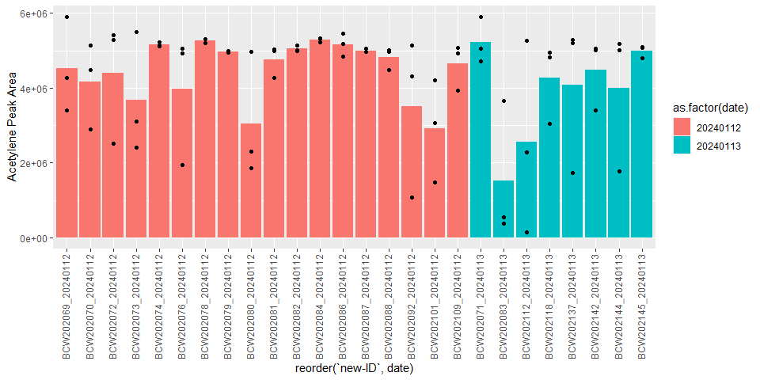
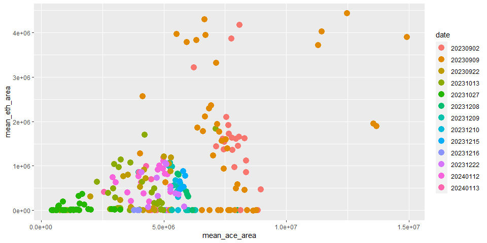

# 2023 HI ARA Analysis

### Import packages and set working directory.

##### R

```r
knitr::opts_knit$set(root.dir = rprojroot::find_rstudio_root_file())
library(reticulate)
library(ggplot2)
library(RColorBrewer)
library(dplyr)
```

##### Python

```python
import pandas as pd
import numpy as np
import os
from sklearn import linear_model
```

### ARA Data

```python
# Importing file
data = pd.read_csv("data/ara-reports.csv")
data = data.replace(r'^\s*$', np.nan, regex=True)
data = data.rename(columns={"Date":"total-date"})
# Extracting date
for i,v in enumerate(data["total-date"]):
  if type(v) == str:
    name = v[:-12]
    data.at[i,"total-date"] = name
  
data["date"] = pd.to_datetime(data["total-date"])
data = data.sort_values("date")

data.to_csv("output/ara-report-dates.csv",index=False)
```

### 2023 ARAs

```python
toptop=pd.DataFrame()
for i in os.listdir("data/"):
  if os.path.isdir("data/"+i):
    path = "data/"+i
    top = pd.DataFrame()
    for j in os.listdir(path):
      name = j.split("_",1)[1].replace("_rep1_MS.csv","").replace("_rep2_MS.csv","").replace("_rep3_MS.csv","").replace("_rep4_MS.csv","").replace("_MS_1.csv","").replace("_rep5_MS.csv","").replace("_MS.csv","")
      # At later dates, I stopped running neg for samples so I didn't say they were "pos". Need to add that label.
      if "pos" not in name and "neg" not in name:
        name = name+"_pos"
      data = pd.read_csv(path+"/"+j, header=3)
      data = data.iloc[:,1:24]
      # Note that these criteria are based on manual inspection of values, subject to change.
      data = data[data["RT"].between(2.56,2.68)]
      # Some small peaks of non-ethylene mess with getting ethylene peak only.
      # If ethylene is present, it is the highest peak, so getting the highest peak within the RT range.
      data = data[data["Area"]==data["Area"].max()]
      data.insert(loc=0,column="ID",value=name)
      top = pd.concat([top,data], axis=0)
    if "uninoc_pos" in top["ID"].to_list():
      blank = top[top["ID"]=="uninoc_pos"]["Area"].mean()
      top = top[top["ID"]!="uninoc_pos"]
      top["Area"] = top["Area"]-blank
      top.reset_index(drop=True,inplace=True)
      top.insert(loc=24,column="date",value=i)
      toptop = pd.concat([top,toptop], axis=0)
    else:
      blank = top[top["ID"]=="blank_pos"]["Area"].mean()
      top = top[top["ID"]!="blank_pos"]
      top["Area"] = top["Area"]-blank
      top.reset_index(drop=True,inplace=True)
      top.insert(loc=24,column="date",value=i)
      toptop = pd.concat([top,toptop], axis=0)
toptop.reset_index(drop=True,inplace=True)
pos = toptop[toptop["ID"].str.contains("pos")]
neg = toptop[toptop["ID"].str.contains("neg")]
#len(pos["ID"].unique())
# Convert peak area to nmol ethylene.
toptopnmol=pd.DataFrame()
toptop["date"]=pd.to_numeric(toptop["date"])
dates=[i for i in toptop["date"].unique()]
dates.sort()
for i in dates:
  subs=toptop[toptop["date"]==i]
  if i<20231208:
    subs["nmol-eth"]=(subs["Area"]-17690)/383.46
    subs["nmol-eth/hr/OD"]=(subs["nmol-eth"]/48/0.1)
    toptopnmol=pd.concat([subs,toptopnmol],axis=0)
  elif subs["ID"].str.contains("ppm").any():
    subsppm=subs[subs["ID"].str.contains("ppm")]
    subsppm=subsppm[~subsppm["ID"].str.contains("_N_")]
    subsppm["concentration"]=pd.to_numeric(subsppm["ID"].str.replace("ppm_pos",""))
    x=subsppm["concentration"].values
    y=subsppm["Area"].values
    x=x.reshape(len(x),1)
    y=y.reshape(len(x),1)
    regr=linear_model.LinearRegression().fit(x,y)
    coef=regr.coef_[0]
    intercept=regr.intercept_[0]
    subs["nmol-eth"]=(subs["Area"]-intercept)/coef
    subs["nmol-eth/hr/OD"]=(subs["nmol-eth"]/48/0.1)
    toptopnmol=pd.concat([subs,toptopnmol],axis=0)
  else:
    # Since this is run sequentially by date, just use the last values if don't have ppm.
    subs["nmol-eth"]=(subs["Area"]-intercept)/coef
    subs["nmol-eth/hr/OD"]=(subs["nmol-eth"]/48/0.1)
    toptopnmol=pd.concat([subs,toptopnmol],axis=0)
```

```
## <string>:4: SettingWithCopyWarning: 
## A value is trying to be set on a copy of a slice from a DataFrame.
## Try using .loc[row_indexer,col_indexer] = value instead
## 
## See the caveats in the documentation: https://pandas.pydata.org/pandas-docs/stable/user_guide/indexing.html#returning-a-view-versus-a-copy
## <string>:5: SettingWithCopyWarning: 
## A value is trying to be set on a copy of a slice from a DataFrame.
## Try using .loc[row_indexer,col_indexer] = value instead
## 
## See the caveats in the documentation: https://pandas.pydata.org/pandas-docs/stable/user_guide/indexing.html#returning-a-view-versus-a-copy
## <string>:4: SettingWithCopyWarning: 
## A value is trying to be set on a copy of a slice from a DataFrame.
## Try using .loc[row_indexer,col_indexer] = value instead
## 
## See the caveats in the documentation: https://pandas.pydata.org/pandas-docs/stable/user_guide/indexing.html#returning-a-view-versus-a-copy
## <string>:5: SettingWithCopyWarning: 
## A value is trying to be set on a copy of a slice from a DataFrame.
## Try using .loc[row_indexer,col_indexer] = value instead
## 
## See the caveats in the documentation: https://pandas.pydata.org/pandas-docs/stable/user_guide/indexing.html#returning-a-view-versus-a-copy
## <string>:4: SettingWithCopyWarning: 
## A value is trying to be set on a copy of a slice from a DataFrame.
## Try using .loc[row_indexer,col_indexer] = value instead
## 
## See the caveats in the documentation: https://pandas.pydata.org/pandas-docs/stable/user_guide/indexing.html#returning-a-view-versus-a-copy
## <string>:5: SettingWithCopyWarning: 
## A value is trying to be set on a copy of a slice from a DataFrame.
## Try using .loc[row_indexer,col_indexer] = value instead
## 
## See the caveats in the documentation: https://pandas.pydata.org/pandas-docs/stable/user_guide/indexing.html#returning-a-view-versus-a-copy
## <string>:4: SettingWithCopyWarning: 
## A value is trying to be set on a copy of a slice from a DataFrame.
## Try using .loc[row_indexer,col_indexer] = value instead
## 
## See the caveats in the documentation: https://pandas.pydata.org/pandas-docs/stable/user_guide/indexing.html#returning-a-view-versus-a-copy
## <string>:5: SettingWithCopyWarning: 
## A value is trying to be set on a copy of a slice from a DataFrame.
## Try using .loc[row_indexer,col_indexer] = value instead
## 
## See the caveats in the documentation: https://pandas.pydata.org/pandas-docs/stable/user_guide/indexing.html#returning-a-view-versus-a-copy
## <string>:4: SettingWithCopyWarning: 
## A value is trying to be set on a copy of a slice from a DataFrame.
## Try using .loc[row_indexer,col_indexer] = value instead
## 
## See the caveats in the documentation: https://pandas.pydata.org/pandas-docs/stable/user_guide/indexing.html#returning-a-view-versus-a-copy
## <string>:5: SettingWithCopyWarning: 
## A value is trying to be set on a copy of a slice from a DataFrame.
## Try using .loc[row_indexer,col_indexer] = value instead
## 
## See the caveats in the documentation: https://pandas.pydata.org/pandas-docs/stable/user_guide/indexing.html#returning-a-view-versus-a-copy
## <string>:18: SettingWithCopyWarning: 
## A value is trying to be set on a copy of a slice from a DataFrame.
## Try using .loc[row_indexer,col_indexer] = value instead
## 
## See the caveats in the documentation: https://pandas.pydata.org/pandas-docs/stable/user_guide/indexing.html#returning-a-view-versus-a-copy
## <string>:19: SettingWithCopyWarning: 
## A value is trying to be set on a copy of a slice from a DataFrame.
## Try using .loc[row_indexer,col_indexer] = value instead
## 
## See the caveats in the documentation: https://pandas.pydata.org/pandas-docs/stable/user_guide/indexing.html#returning-a-view-versus-a-copy
## <string>:18: SettingWithCopyWarning: 
## A value is trying to be set on a copy of a slice from a DataFrame.
## Try using .loc[row_indexer,col_indexer] = value instead
## 
## See the caveats in the documentation: https://pandas.pydata.org/pandas-docs/stable/user_guide/indexing.html#returning-a-view-versus-a-copy
## <string>:19: SettingWithCopyWarning: 
## A value is trying to be set on a copy of a slice from a DataFrame.
## Try using .loc[row_indexer,col_indexer] = value instead
## 
## See the caveats in the documentation: https://pandas.pydata.org/pandas-docs/stable/user_guide/indexing.html#returning-a-view-versus-a-copy
## <string>:23: SettingWithCopyWarning: 
## A value is trying to be set on a copy of a slice from a DataFrame.
## Try using .loc[row_indexer,col_indexer] = value instead
## 
## See the caveats in the documentation: https://pandas.pydata.org/pandas-docs/stable/user_guide/indexing.html#returning-a-view-versus-a-copy
## <string>:24: SettingWithCopyWarning: 
## A value is trying to be set on a copy of a slice from a DataFrame.
## Try using .loc[row_indexer,col_indexer] = value instead
## 
## See the caveats in the documentation: https://pandas.pydata.org/pandas-docs/stable/user_guide/indexing.html#returning-a-view-versus-a-copy
```

```python
toptopnmol=toptopnmol[~toptopnmol["ID"].str.contains("ppm")]
toptopnmol=toptopnmol[~toptopnmol["ID"].str.contains("blank")]
toptopnmol=toptopnmol[~toptopnmol["ID"].str.contains("neg")]
toptopnmol["date"]=toptopnmol["date"].astype(str)
toptopnmol["new-ID"]=toptopnmol["ID"].str.replace("_pos","_")+toptopnmol["date"]

# We're assuming 48hr incubation for all. There are slight variations (+-2hr). Can correct in the future.

# Removing Totontepec.
#meta=pd.read_csv("data/2022-06-30_molokai-isolate-catalog - Copy.csv")
#meta=meta.iloc[:-1,:]
#toton=meta[meta["Sample Type "].str.contains("Totontepec")]
#len(toton)
#toton["BCW_ID"]=toton["BCW_ID"].str.replace("BCW_","BCW")
#non = list(set([i for i in pos["ID"] if i.replace("_pos","") not in toton["BCW_ID"].to_list()]))
#nontoton=pos[pos["ID"].isin(non)]
#final_non=pd.DataFrame({"ID":nontoton["ID"].str.replace("_pos","").unique()})
#final_non.to_csv("../2023_wgs_dna/data/20231106_nontoton-ara-screened.csv",index=False)
#len(pos["ID"].unique())
```


```r
data = py$toptopnmol
#ggplot(data=data%>%filter(Area<10000),aes(x=RT,y=Area))+
#  geom_point()

ggplot(data=data, aes(x=`new-ID`, y=`nmol-eth/hr/OD`)) +
  geom_bar(stat="summary",fun="mean", aes(fill=date)) + 
  geom_point() +
  geom_hline(yintercept=750,linetype="dashed")+
  scale_y_continuous(breaks=c(0,500,750,1000,1500,2000,2500),labels=c(0,500,"A. brasilense",1000,1500,2000,2500)) +
  #annotate("text",x=100,y=750,label="A. brasilense (Van Deynze et. al 2018)") +
  ylab("Nanomoles of Ethylene/hr/OD600") +
  xlab("Isolate") +
  theme(axis.text.x = element_blank())
```

<!-- -->

```r
        #element_text(angle=90, vjust=0.3))

ggplot(data=data, aes(x=reorder(`new-ID`,-`nmol-eth/hr/OD`), y=`nmol-eth/hr/OD`)) +
  geom_bar(stat="summary",fun="mean", aes(fill=date)) + 
  geom_point() +
  geom_hline(yintercept=750,linetype="dashed")+
  scale_y_continuous(breaks=c(0,500,750,1000,1500,2000,2500),labels=c(0,500,"A. brasilense",1000,1500,2000,2500)) +
  #annotate("text",x=100,y=750,label="A. brasilense (Van Deynze et. al 2018)") +
  ylab("Nanomoles of Ethylene/hr/OD600") +
  xlab("Isolate") +
  theme(axis.text.x = element_blank())
```

<!-- -->

```r
ggplot(data=data%>%filter(date=="20231208" | date=="20231209" | date=="20231210"), aes(x=`new-ID`, y=`nmol-eth/hr/OD`)) +
  geom_bar(stat="summary",fun="mean", aes(fill=date)) + 
  geom_point() +
  geom_hline(yintercept=750,linetype="dashed")+
  scale_y_continuous(breaks=c(0,500,750,1000,1500,2000,2500),labels=c(0,500,"A. brasilense",1000,1500,2000,2500)) +
  #annotate("text",x=100,y=750,label="A. brasilense (Van Deynze et. al 2018)") +
  ylab("Nanomoles of Ethylene/hr/OD600") +
  theme(axis.text.x = element_text(angle=90, vjust=0.3))
```

<!-- -->

```r
ggplot(data=data%>%filter(grepl("BCW200241|Ecoli|BCW200232",ID))%>%filter(date=="20231210"), aes(x=`new-ID`, y=`nmol-eth/hr/OD`)) +
  geom_bar(stat="summary",fun="mean", aes(fill=date)) + 
  geom_point() +
  #geom_hline(yintercept=750,linetype="dashed")+
  #scale_y_continuous(breaks=c(0,500,750,1000,1500,2000,2500),labels=c(0,500,"A. brasilense",1000,1500,2000,2500)) +
  #annotate("text",x=100,y=750,label="A. brasilense (Van Deynze et. al 2018)") +
  ylab("Nanomoles of Ethylene/hr/OD600") +
  xlab("Isolate") +
  theme(axis.text.x = element_text(angle=90, vjust=0.3))
```

<!-- -->

```r
# Simple filter to remove small values.
#ggplot(data=filter(data,Area>10000), aes(x=date,y=`nmol-eth/hr/OD`)) +
#  geom_boxplot()
```

### Acetylene

```python
toptop=pd.DataFrame()
for i in os.listdir("data/"):
  if os.path.isdir("data/"+i):
    path = "data/"+i
    for j in os.listdir(path):
      name = j.split("_",1)[1].replace("_rep1_MS.csv","").replace("_rep2_MS.csv","").replace("_rep3_MS.csv","").replace("_rep4_MS.csv","").replace("_MS_1.csv","").replace("_rep5_MS.csv","").replace("_MS.csv","")
      # At later dates, I stopped running neg for samples so I didn't say they were "pos". Need to add that label.
      if "pos" not in name and "neg" not in name:
        name = name+"_pos"
      data = pd.read_csv(path+"/"+j, header=3)
      data = data.iloc[:,1:24]
      # Note that these criteria are based on manual inspection of values, subject to change.
      data = data[data["RT"].between(4.7,5.4)]
      # Some small peaks of non-ethylene mess with getting ethylene peak only.
      # If ethylene is present, it is the highest peak, so getting the highest peak within the RT range.
      data = data[data["Area"]==data["Area"].max()]
      data.insert(loc=0,column="ID",value=name)
      data.insert(loc=24,column="date",value=i)
      toptop = pd.concat([toptop,data], axis=0)
toptop.reset_index(drop=True,inplace=True)
finalace = toptop[~toptop["ID"].str.contains("blank")]
finalace = finalace[~finalace["ID"].str.contains("uninoc")]
finalace = finalace[~finalace["ID"].str.contains("neg")]
finalace = finalace[~finalace["ID"].str.contains("ppm")]
finalace["new-ID"]=finalace["ID"].str.replace("_pos","_")+finalace["date"]
```


```r
ace=py$finalace
data=py$toptopnmol

ggplot(data=ace, aes(x=`new-ID`, y=Area)) +
  geom_bar(stat="summary",fun="mean", aes(fill=date)) + 
  geom_point() +
  #geom_hline(yintercept=750,linetype="dashed")+
  #scale_y_continuous(breaks=c(0,500,750,1000,1500,2000,2500),labels=c(0,500,"A. brasilense",1000,1500,2000,2500)) +
  #annotate("text",x=100,y=750,label="A. brasilense (Van Deynze et. al 2018)") +
  ylab("Acetylene Peak Area") +
  theme(axis.text.x = element_text(angle=90, vjust=0.3))
```

<!-- -->

```r
mean_ace=ace%>%group_by(`new-ID`,date)%>%summarize(mean_ace_area=mean(Area))
```

```
## `summarise()` has grouped output by 'new-ID'. You can override using the
## `.groups` argument.
```

```r
mean_eth=data%>%group_by(`new-ID`,date)%>%summarize(mean_eth_area=mean(Area),mean_nmol_per_hr_OD=mean(`nmol-eth/hr/OD`))
```

```
## `summarise()` has grouped output by 'new-ID'. You can override using the
## `.groups` argument.
```

```r
test=merge(x=mean_eth,y=mean_ace,by=c("new-ID","date"))
ggplot(data=test, aes(x=mean_ace_area,y=mean_eth_area,color=date)) +
  geom_point(size=4)
```

<!-- -->

```r
ggplot(data=test%>%filter(mean_eth_area<1000000), aes(x=mean_ace_area,y=mean_eth_area,color=date)) +
  geom_point(size=4)
```

<!-- -->
